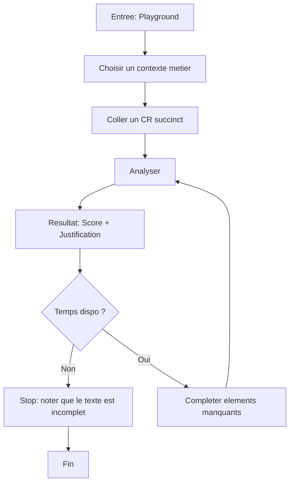
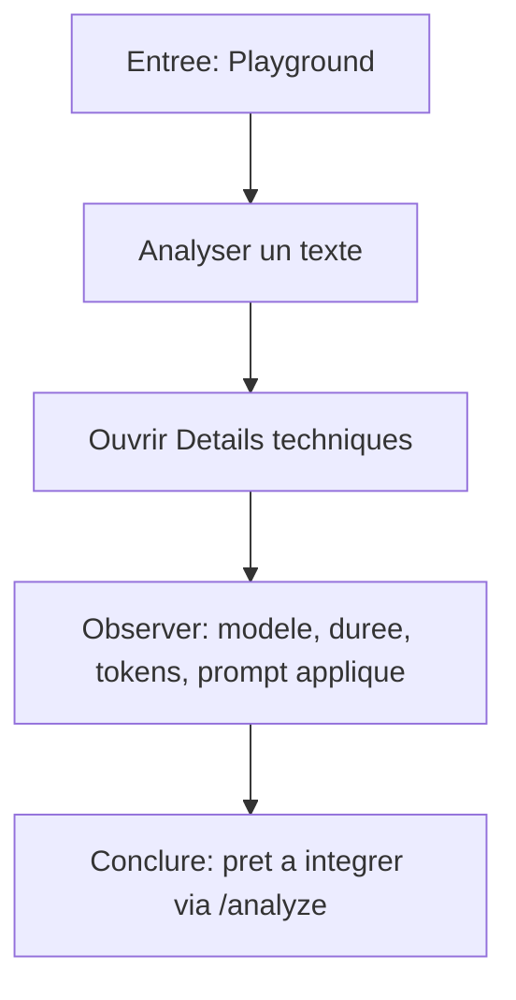

# UX Design Specification CoVeX

**Author:** JBU
**Date:** 2025-02-01

---

## Executive Summary

### Project Vision

**CoVeX (Complétude Vérification eXpert)** est un moteur d'analyse de la completude des textes libres. Il s'attaque a la dette informationelle - l'accumulation de textes incomplets (tickets, demandes, rapports) qui genere des allers-retours couteux et des donnees inexploitables.

**Proposition de valeur unique :**
- **Fond, pas forme** : Évalue les informations présentes, pas la grammaire
- **100% souverain** : SLM locaux, aucune donnée cloud
- **Configurable par métier** : Prompts YAML définissables par les experts métier

### Target Users

**Personas principaux (9 sur 3 secteurs) :**

| Persona | Profil | Mode UX |
|---------|--------|---------|
| **GO** 🔧 | Technicien terrain | Asynchrone (non-bloquant) |
| **VOX** 🎙️ | Chef de projet | Synchrone + Guidé |
| **ZAP** ➡️ | Demandeur pressé | Synchrone (< 2s) |
| **NEW** 🔍 | Nouvel utilisateur | Guidé pédagogique |
| **CIT** 🏠 | Citoyen | Guidé bienveillant |
| **MOA** 🏗️ | Maître d'ouvrage BTP | Synchrone |
| **OPS** 🛠️ | Opérationnel chantier | Asynchrone |
| **Configurateur** ⚙️ | Expert métier | Configuration |
| **Intégrateur** 💻 | Développeur | API REST |

**Contexte d'usage Playground MVP :**
- **Audience primaire** : Démonstrateur pour présentation aux décideurs
- **Simulation** : Imite l'expérience utilisateur final (ZAP, CIT, etc.)
- **Objectif** : Convaincre de la valeur CoVeX en conditions réalistes

### Key Design Challenges

| Défi | Description |
|------|-------------|
| **Feedback dual-mode** | Supporter synchrone (bloquant) ET asynchrone selon contexte |
| **Ton adaptatif** | Bienveillant (CIT/NEW) vs direct (ZAP) vs neutre (GO) |
| **Transparence vs Simplicité** | Montrer le "pourquoi" sans submerger |
| **Indicateur visuel de score** | Rendre le 0-100 immédiatement lisible |

### Design Opportunities

| Opportunité | Description |
|-------------|-------------|
| **Moment "Aha!"** | Feedback instantané et actionnable avant intervention humaine |
| **Guidage constructif** | Pas juste "KO" mais ce qui manque + exemples |
| **Outil de confiance** | Tester avant déployer, réduire la peur de l'IA |
| **Gamification subtile** | Score comme motivation intrinsèque |

### Design Direction

| Axe | Choix |
|-----|-------|
| **Ton** | Professionnel |
| **Densité** | Épuré, moderne (détails en panneau secondaire) |
| **Cible MVP** | Démonstrateur pour décideurs |

## Core User Experience

### Defining Experience

**Action Core :** Soumettre un texte → Recevoir un verdict instantané (Score + Justification)

Cette boucle fondamentale définit toute la valeur de CoVeX. L'utilisateur doit pouvoir :
1. Coller/saisir un texte (ticket, demande, rapport)
2. Cliquer "Analyser"
3. Voir immédiatement le résultat complet

**Contexte Démonstrateur :**
- Audience : Décideurs évaluant la solution
- Objectif : Convaincre en conditions réalistes
- Contrainte : Chaque interaction doit impressionner

### Platform Strategy

| Aspect | Choix | Justification |
|--------|-------|---------------|
| **Plateforme** | Web (NiceGUI) | Démonstration facile, pas d'installation |
| **Input** | Souris/clavier | Démo sur laptop/desktop |
| **Layout** | Desktop-first | Contexte présentation (projecteur, écran partagé) |
| **Offline** | Non requis | Ollama local = souveraineté sans contrainte réseau |

### Effortless Interactions

| Interaction | Design |
|-------------|--------|
| **Soumettre un texte** | Zone de saisie large + bouton unique "Analyser" |
| **Comprendre le verdict** | Couleur + Label + Explication (hiérarchie visuelle) |
| **Changer de contexte** | Dropdown obligatoire avec sélection explicite du prompt |
| **Charger un exemple** | Boutons quick-load (texte incomplet / texte complet) |
| **Voir les détails** | Panneau dépliable (opt-in, fermé par défaut) |

**Automatismes (zéro effort) :**
- Chargement de la liste des profils d'analyse disponibles pour guider une sélection explicite rapide
- Formatage visuel du score (couleur KO/PARTIEL/OK)
- Affichage direct du résultat (pas d'animation, instantané)

### Critical Success Moments

| Moment | Description | Critère |
|--------|-------------|---------|
| **1. "Wow" initial** | Premier texte → verdict < 2s | Vitesse impressionne |
| **2. Pertinence** | Justification "tape juste" | Valeur métier reconnue |
| **3. Progression** | Texte corrigé → score monte | Feedback loop visible |
| **4. Transparence** | Détails techniques accessibles | Crédibilité technique |

**Moment make-or-break :**
> Le décideur lit la justification et pense *"C'est exactement ce qu'un expert humain aurait dit"*

### Experience Principles

| # | Principe | Application |
|---|----------|-------------|
| **1** | **Verdict Immédiat** | Résultat < 2 secondes, affichage direct sans animation |
| **2** | **Clarté Hiérarchique** | Score → Décision → Justification |
| **3** | **Profondeur Progressive** | Épuré par défaut, détails en opt-in |
| **4** | **Confiance par Transparence** | Toujours montrer le "pourquoi" |
| **5** | **Démo-Ready** | Exemples pré-remplis pour faciliter la présentation |

## Desired Emotional Response

### Primary Emotional Goals

**Double cible émotionnelle (contexte démonstrateur) :**

| Cible | Émotion Primaire | Émotion Secondaire |
|-------|------------------|-------------------|
| **Décideur observant** | Impressionné → Convaincu | Rassuré (crédibilité technique) |
| **Utilisateur simulé** | Efficace, respecté | Guidé sans être jugé |

**Émotion make-or-break :**
> Le décideur pense *"Mes équipes pourraient vraiment utiliser ça"*

### Emotional Journey Mapping

| Étape | Émotion Visée | Design Support |
|-------|---------------|----------------|
| **Découverte** | Curiosité + Clarté | Interface épurée, accueil sobre |
| **Saisie** | Confiance | Zone large, pas de friction |
| **Attente** | Anticipation légère | Feedback quasi-instantané |
| **Verdict** | Compréhension immédiate | Score coloré + décision claire |
| **Justification** | Reconnaissance | *"C'est exactement ce qui manquait"* |
| **Correction** | Motivation | Score qui monte = récompense |
| **Détails** | Maîtrise | Panneau technique = contrôle |

### Micro-Emotions

| Micro-Émotion | Priorité | Approche |
|---------------|----------|----------|
| **Confiance** vs Scepticisme | Critique | Transparence totale |
| **Compétence** vs Incompétence | Critique | Ton factuel, jamais culpabilisant |
| **Contrôle** vs Impuissance | Haute | Choix utilisateur préservé |
| **Respect** vs Condescendance | Haute | Formulations neutres |

### Design Implications

| Émotion | Implication UX |
|---------|----------------|
| **Impressionné** | Latence < 2s visible, pas de spinner prolongé |
| **Convaincu** | Justifications métier concrètes |
| **Confiance** | Modèle, prompt, tokens affichés |
| **Compétence** | Ton factuel : "Manque : X, Y" |
| **Contrôle** | Exemples pré-remplis, sélecteur visible |
| **Motivation** | Score numérique = progression mesurable |

**Ton des messages :**
- Style **factuel** : "Éléments manquants : référence produit, quantité"
- Score KO : **neutre**, liste ce qui manque sans encouragement superflu

### Emotional Design Principles

| # | Principe | Application |
|---|----------|-------------|
| **1** | **Impressionner par la vitesse** | < 2s = effet "wow" |
| **2** | **Convaincre par la pertinence** | Justifications métier |
| **3** | **Rassurer par la transparence** | Tout visible en opt-in |
| **4** | **Respecter par le ton** | Factuel, neutre, jamais culpabilisant |
| **5** | **Motiver par la progression** | Score monte = récompense |

## UX Pattern Analysis & Inspiration

### Inspiring Products Analysis

| Produit | Forces UX | Pattern Retenu |
|---------|-----------|----------------|
| **ChatGPT/Claude** | Simplicité, zone unique, distinction input/output | Interface minimaliste |
| **Grammarly** | Score visible, code couleur, détails à la demande | Feedback coloré progressif |
| **OpenAI Playground** | Sélecteur clair, paramètres accessibles, zone large | Transparence technique opt-in |

### Transferable UX Patterns

| Catégorie | Pattern | Application |
|-----------|---------|-------------|
| **Layout** | Input / Output séparés visuellement | Saisie haut, résultat bas |
| **Feedback** | Score + Badge couleur | KO (rouge) / PARTIEL (orange) / OK (vert) |
| **Hiérarchie** | Progressive disclosure | Score → Décision → Justification → Détails |
| **Action** | Bouton primaire unique | "Analyser" proéminent |
| **Contexte** | Dropdown explicite | Choix obligatoire avant analyse |
| **Démo** | Quick-load examples | Boutons exemples pré-remplis |

### Anti-Patterns to Avoid

| Anti-Pattern | Risque |
|--------------|--------|
| Formulaires multi-champs | Friction, perte effet "wow" |
| Spinners prolongés | Anxiété, casse promesse < 2s |
| Jargon IA en surface | Incompréhension décideur |
| Résultat sans explication | Effet boîte noire |
| Trop d'options visibles | Paralysie, démo moins fluide |
| Animation du score | Délai artificiel perçu |

### Design Inspiration Strategy

**Adopter :**
- Zone saisie unique + 1 bouton (ChatGPT)
- Score coloré proéminent (Grammarly)
- Panneau détails dépliable (OpenAI Playground)

**Adapter :**
- Suggestions → Liste factuelle "Manque : X, Y"
- Streaming → Affichage direct complet

**Éviter :**
- Multi-formulaires
- Jargon technique visible
- Résultats sans justification

## Design System Foundation

### Design System Choice

**Choix : Quasar natif (100% standard)**

Framework intégré à NiceGUI, basé sur Material Design. Aucune customisation CSS.

### Rationale for Selection

| Critère | Justification |
|---------|---------------|
| **Rapidité** | Composants prêts à l'emploi, zéro configuration |
| **Cohérence** | Material Design = patterns UX éprouvés |
| **Maintenance** | Pas de CSS custom à maintenir |
| **Professionnel** | Look sérieux par défaut, adapté aux décideurs |
| **Focus** | Énergie sur le moteur IA, pas sur le styling |

### Implementation Approach

**Composants Quasar à utiliser :**

| Besoin UI | Composant Quasar |
|-----------|------------------|
| Zone de saisie | `ui.textarea` |
| Bouton principal | `ui.button` (primary) |
| Sélecteur contexte | `ui.select` |
| Affichage score | `ui.label` + `ui.badge` |
| Panneau détails | `ui.expansion` |
| Boutons exemples | `ui.button` (secondary/outline) |
| Layout | `ui.card`, `ui.row`, `ui.column` |

**Couleurs standard Quasar :**

| Décision | Couleur Quasar |
|----------|----------------|
| **KO** (0-30) | `negative` (rouge) |
| **PARTIEL** (31-70) | `warning` (orange) |
| **OK** (71-100) | `positive` (vert) |

### Customization Strategy

**Stratégie : Zéro customisation**

- Utiliser les couleurs Quasar natives (`positive`, `negative`, `warning`, `primary`)
- Utiliser les espacements par défaut
- Utiliser la typographie par défaut (Roboto)
- Aucun fichier CSS custom

**Avantages :**
- Démarrage immédiat
- Résultat prévisible
- Mise à jour NiceGUI sans conflit
- Documentation Quasar directement applicable

## Defining Experience

### Core Interaction

**L'expérience définissante CoVeX :**
> "Colle ton texte, vois si c'est complet"

Interaction simple, immédiate, actionnable — ce que l'utilisateur décrira à ses collègues.

### User Mental Model

**Solutions actuelles et leurs limites :**

| Méthode | Problème |
|---------|----------|
| Relecture manuelle | Subjectif, oublis |
| Checklist | Fastidieux |
| Reviewer humain | Délai (jours) |
| Correcteur grammaire | Forme, pas fond |

**Attente utilisateur :**
- Coller → verdict instantané
- Si KO → savoir ce qui manque
- Pas d'attente humaine

### Success Criteria

| Critère | Indicateur |
|---------|------------|
| **"Ça marche"** | Résultat < 2 secondes |
| **"Je comprends"** | Badge couleur lisible |
| **"C'est pertinent"** | Justification métier |
| **"Je peux corriger"** | Re-analyse possible |
| **"Je fais confiance"** | Détails accessibles |

### Novel UX Patterns

**Analyse : 90% établi, 10% innovation**

| Aspect | Type |
|--------|------|
| Zone de saisie | Établi |
| Bouton action | Établi |
| Score + Badge | Établi |
| Justification IA | Semi-novel |
| Sélection explicite du contexte | Établi |

L'innovation est dans la **combinaison**, pas les interactions individuelles. Pas d'éducation utilisateur requise.

### Experience Mechanics

**1. Initiation**
- Page prête avec zone vide
- Placeholder invitant
- Boutons exemples visibles

**2. Interaction**
- Coller ou taper le texte
- Contexte explicitement sélectionné avant analyse
- Bouton "Analyser" proéminent

**3. Feedback**
- Résultat < 2s, pas de transition
- Score → Badge → Justification
- Erreur : message clair

**4. Complétion**
- Badge OK = succès
- Modifier → re-analyser
- Détails en opt-in

## Visual Design Foundation

### Color System

**Stratégie : Couleurs Quasar natives (Material Design)**

| Rôle | Couleur Quasar | Usage |
|------|----------------|-------|
| **Primary** | `primary` | Bouton "Analyser", liens |
| **Positive** | `positive` | Score OK (71-100) |
| **Warning** | `warning` | Score PARTIEL (31-70) |
| **Negative** | `negative` | Score KO (0-30) |
| **Info** | `info` | Panneau détails |

**Mapping Score :**
- 0-30 → KO → `negative` (rouge)
- 31-70 → PARTIEL → `warning` (orange)
- 71-100 → OK → `positive` (vert)

### Typography System

**Police : Roboto (défaut Quasar)**

| Élément | Style |
|---------|-------|
| Score | 48px Bold |
| Badge | 14px Bold Uppercase |
| Justification | 16px Regular |
| Détails | 12px Regular |

**Hiérarchie :** Score > Badge > Justification > Détails

### Spacing & Layout Foundation

**Espacements Quasar par défaut :**
- Padding card : 16px
- Gap sections : 24px
- Marge boutons : 8px

**Layout : Vertical single-column**
- Header (titre)
- Sélecteur contexte
- Zone saisie texte
- Boutons actions
- Zone résultat (score + justification)
- Panneau détails (dépliable)

### Accessibility Considerations

| Critère | Status |
|---------|--------|
| Contraste WCAG AA | ✅ Quasar natif |
| Taille min 12px | ✅ |
| Pas couleur seule | ✅ Badge texte + couleur |
| Focus visible | ✅ Quasar natif |

## User Journey Flows

### Journey 1 — ZAP (Synchrone / Assistance)

Objectif: obtenir un verdict immediat, puis iterer jusqu'a OK.

```mermaid
flowchart TD
  A[Entree: Playground] --> B[Choisir un contexte metier]
  B --> C[Saisir / coller un texte]
  C --> D[Clic: Analyser]
  D --> E{API dispo ?}
  E -- Non --> E1[Afficher erreur neutre: service indisponible] --> C
  E -- Oui --> F[Afficher resultat: Score + Badge + Justification]
  F --> G{Decision ?}
  G -- OK --> H[Succes: pret a soumettre / copier]
  G -- PARTIEL/KO --> I[Lire "Elements manquants"]
  I --> J[Editer le texte]
  J --> D
```

Optimisations cles:
- Hierarchie fixe: Score -> Badge -> Justification (factuel, neutre)
- Contexte sélectionné visible avant envoi + dropdown obligatoire (controle)

### Journey 2 — GO (Asynchrone / Non-bloquant)

Objectif: ne pas bloquer l'operationnel, mais permettre une amelioration rapide quand on le souhaite.



Optimisations cles:
- "Non-bloquant" = l'utilisateur peut s'arreter apres la justification
- Valeur immediate = justif exploitable meme sans correction

### Journey 3 — CIT / NEW (Guide mais neutre)

Objectif: reduire la confusion via une checklist explicite sans ton paternaliste.

```mermaid
flowchart TD
  A[Entree: Playground] --> B[Choisir un contexte metier adapte]
  B --> C[Texte court / vague]
  C --> D[Analyser]
  D --> E[Resultat: KO ou PARTIEL]
  E --> F[Afficher checklist "Elements manquants" (liste)]
  F --> G[Option: afficher Exemple (opt-in)]
  G --> H[Utilisateur complete son texte]
  H --> D
  D --> I{OK ?}
  I -- Oui --> J[Succes]
  I -- Non --> F
```

Optimisations cles:
- Liste "Elements manquants" priorisee (critique -> important -> souhaitable)
- Exemple derriere un details (profondeur progressive)

### Journey 4 — Configurateur (Validation prompt par la demo)

Objectif: prouver la pertinence du prompt via des exemples KO->OK.

```mermaid
flowchart TD
  A[Entree: Playground] --> B[Choisir un prompt metier explicite]
  B --> C[Charger Exemple KO]
  C --> D[Analyser] --> E[Lire justification / manquants]
  E --> F[Charger Exemple OK (ou corriger le KO)]
  F --> D --> G[Comparer scores et justifs]
  G --> H[Decision: prompt acceptable pour demo / pilote]
```

Optimisations cles:
- Boutons "Exemple KO/OK" = accelere la preuve (demo-ready)
- Details techniques visibles en opt-in (credibilite)

### Journey 5 — Integrateur (Validation API via la demo)

Objectif: montrer la contractabilite (JSON) et la predictibilite du systeme.



Optimisations cles:
- Details techniques structures et stables
- Erreurs API neutres, sans stack trace

### Journey Patterns

- Pattern 1: Choix explicite du contexte avant analyse
- Pattern 2: Progressive disclosure (UI epuree; details en opt-in)
- Pattern 3: Iteration loop (KO/PARTIEL -> liste manquants -> editer -> re-analyser)
- Pattern 4: Evidence for decision makers (exemples + latence + transparence)

### Flow Optimization Principles

- Minimiser le temps jusqu'au verdict (objectif: < 2s)
- Feedback factuel, neutre, oriente "manque X/Y"
- Tolerance aux erreurs (API down) avec message clair et retour au texte
- Meme hierarchie partout (score/badge/justif) pour reduire la charge cognitive

## Component Strategy

### Design System Components

**Fondation: NiceGUI / Quasar (100% standard)**

Composants utilises (directs Quasar):
- `ui.card` / `ui.row` / `ui.column` : structure de page
- `ui.select` : selecteur de contexte (prompts uniquement)
- `ui.textarea` : saisie du texte
- `ui.button` : actions (Exemples, Analyser)
- `ui.label` + `ui.badge` : score + decision (KO/PARTIEL/OK)
- `ui.expansion` : details techniques (opt-in)
- `ui.notify` ou `ui.label` : erreurs neutres (service indisponible)

### Custom Components

**Strategie: "composites" (assemblages) sans CSS custom**

#### AnalyzeForm

Purpose: capter le texte + contexte et declencher l'analyse.
- Anatomy: select contexte + textarea + barre d'actions (Exemples / Analyser)
- States: default, analyzing (bouton desactive), error (message neutre)
- Accessibility: focus natif Quasar, labels explicites

#### ExampleButtons

Purpose: charger instantanement des exemples demo-ready (KO / PARTIEL / OK).
- Variants: set "IT", "Achat", "Citoyen" (optionnel)
- States: default, active (exemple charge)

#### ResultPanel

Purpose: afficher la hierarchie fixe Score -> Badge -> Justification.
- States:
  - empty (avant premiere analyse)
  - success (OK/PARTIEL/KO)
  - error (API indisponible)
- Content guidelines: justification factuelle, neutre; "Elements manquants" listee

#### MissingElementsList

Purpose: rendre la liste "Elements manquants" scannable (critique -> important -> souhaitable si dispo).
- States: none, some, many
- Interaction: aucune (lecture)

#### TechnicalDetailsExpansion

Purpose: credibilite + transparence technique (opt-in).
- Content: modele, provider, duree, tokens, prompt applique
- State: collapsed by default

### Component Implementation Strategy

- Construire en blocs reutilisables (fonctions Python / classes) plutot que du style custom.
- Maintenir une hierarchie d'information stable partout:
  - Score (dominant) + Badge (couleur) + Justification (texte) + Details (opt-in)
- Mapping decision -> couleur Quasar:
  - KO -> `negative`, PARTIEL -> `warning`, OK -> `positive`

### Implementation Roadmap

Phase 1 (MVP demo):
- AnalyzeForm
- ResultPanel
- TechnicalDetailsExpansion
- Error handling neutre (API down)

Phase 2 (demo fluide):
- ExampleButtons (bibliotheque d'exemples)
- MissingElementsList (liste propre + priorisation)

Phase 3 (confort):
- Actions "Copier resultat" / "Copier JSON"
- Presets par persona (ZAP/CIT/GO) si besoin

## UX Consistency Patterns

### Button Hierarchy

- Primary: `Analyser` (unique action principale par ecran)
- Secondary: `Exemple KO`, `Exemple OK`, `Copier resultat` (si ajoute)
- Destructive: aucun (MVP)
- Disabled state: `Analyser` desactive pendant analyzing / si texte vide

### Feedback Patterns

- Success (OK): badge `positive` + score + justification factuelle
- Warning (PARTIEL): badge `warning` + liste "Elements manquants"
- Error (KO): badge `negative` + liste "Elements manquants"
- System error (API down): message neutre "Service indisponible" + conserver le texte, aucune perte de saisie
- No spinner long: si latence > seuil, afficher "Analyse en cours..." (sans dramatiser)

### Form Patterns

- Contexte:
  - Default: aucune valeur preselectionnee
  - Override: dropdown toujours visible
- Texte:
  - Textarea large, placeholder explicite
  - Validation: "texte requis" uniquement (pas d'autres contraintes)

### Navigation Patterns

- Single page (MVP): pas de navigation complexe
- Sections verticales: Input (haut) -> Actions -> Output -> Details (opt-in)

### Additional Patterns

- Progressive disclosure:
  - Details techniques via `ui.expansion` (ferme par defaut)
  - Exemple de formulation (pour Guided) via `details`
- Iteration loop:
  - Toujours permettre editer -> re-analyser sans reset
- Consistency mapping:
  - KO -> `negative`, PARTIEL -> `warning`, OK -> `positive`

## Responsive Design & Accessibility

### Responsive Strategy

- Desktop-first (contexte demo) avec mise en page single-column verticale.
- Desktop large: possibilite d'une variante split view (input gauche / output droite) si besoin, mais pas necessaire au MVP.
- Tablet: conserver single-column; boutons passent en wrap; details en accordeon.
- Mobile: conserver single-column; actions en pile (Exemples au-dessus, Analyser en bas); score reste prioritaire.

### Breakpoint Strategy

- Breakpoints standards:
  - Mobile: < 768px
  - Tablet: 768px - 1023px
  - Desktop: >= 1024px
- Comportements:
  - < 768px: actions empilees; textarea pleine largeur; expansion details en bas
  - >= 1024px: espacement confortable, score plus visible

### Accessibility Strategy

- Cible: WCAG AA (recommande).
- Clavier:
  - Tab order: Contexte -> Textarea -> Exemples -> Analyser -> Resultat -> Details
  - Focus visible (Quasar natif)
- Contraste:
  - S'appuyer sur couleurs Quasar AA; ne jamais utiliser couleur seule (badge texte + couleur)
- Screen reader:
  - Labels explicites pour select/textarea
  - Annoncer le resultat (score + decision) apres analyse
- Touch targets:
  - Boutons >= 44x44px sur mobile (Quasar par defaut + padding)

### Testing Strategy

- Responsive:
  - Chrome + Safari (macOS)
  - Test largeur 375, 768, 1024, 1440
- Accessibility:
  - Navigation clavier-only
  - VoiceOver (macOS) sur page principale
  - Verification contrastes (outil navigateur)
- Performance UX:
  - Verifier latence percue: < 2s
  - Simuler API down: message neutre, pas de perte de texte

### Implementation Guidelines

- Garder la hierarchie stable: Score -> Badge -> Justification -> Details
- Ne pas reflow brutal: afficher resultat dans un conteneur reserve (eviter sauts de layout)
- Erreurs:
  - Pas de stack trace; message court; action de reprise (re-essayer)
- Mobile:
  - `ui.row().classes('q-gutter-sm')` + wrap; boutons en colonne si necessaire
