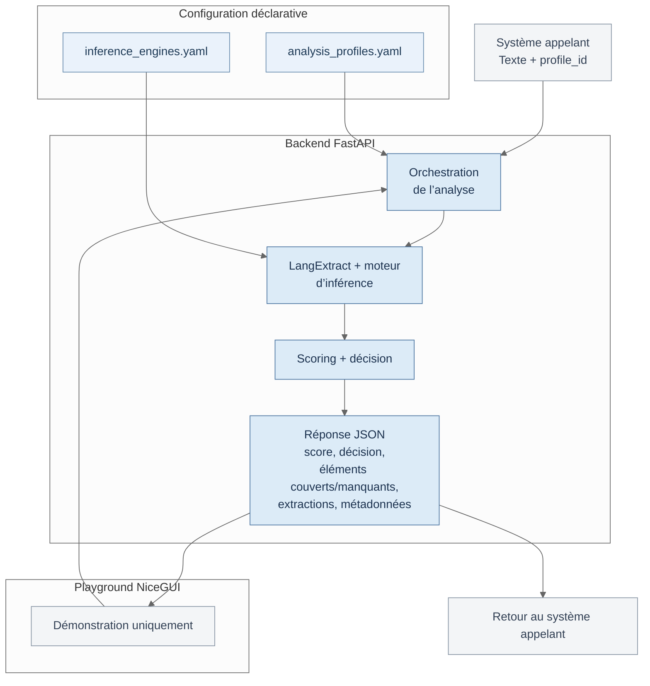
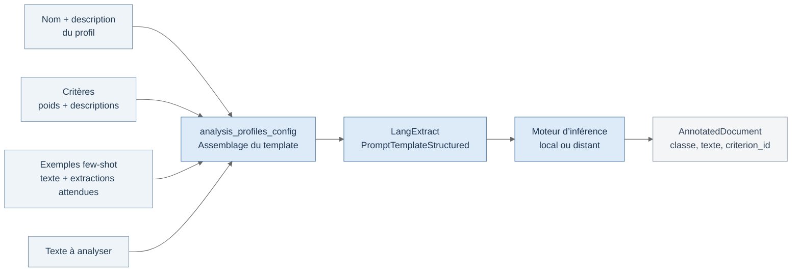
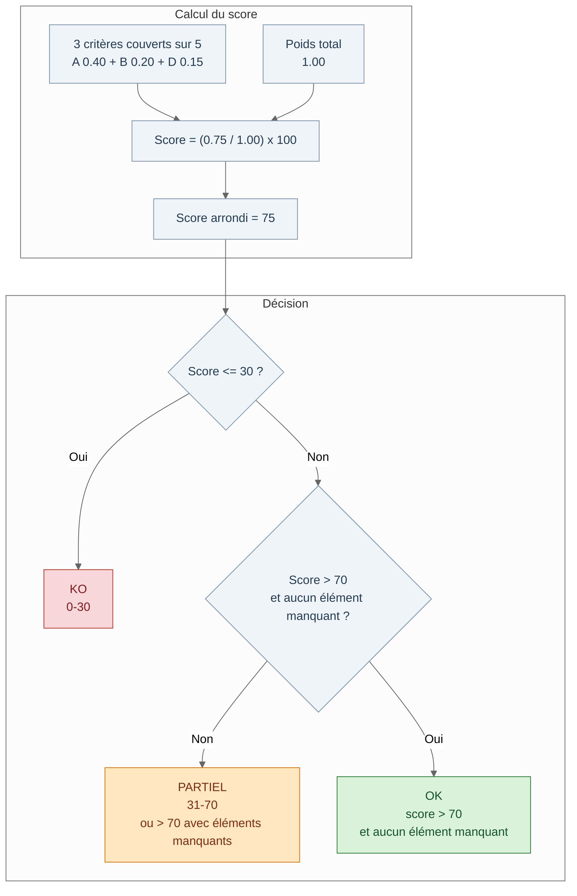
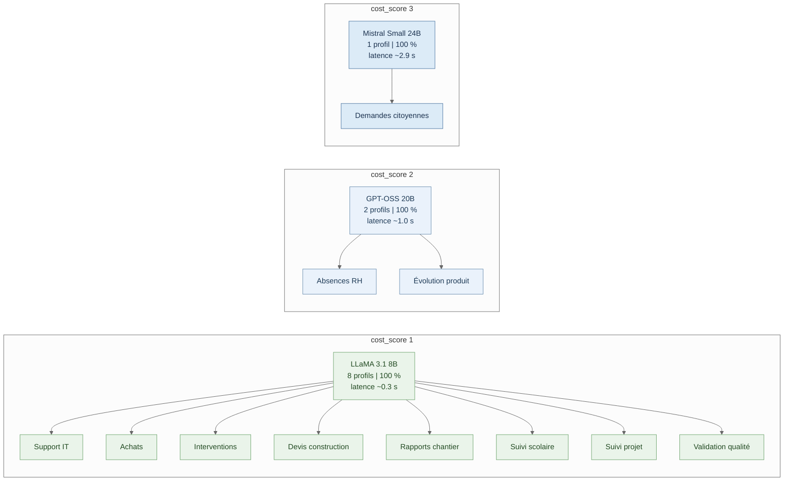
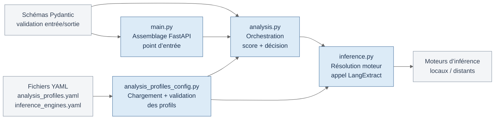
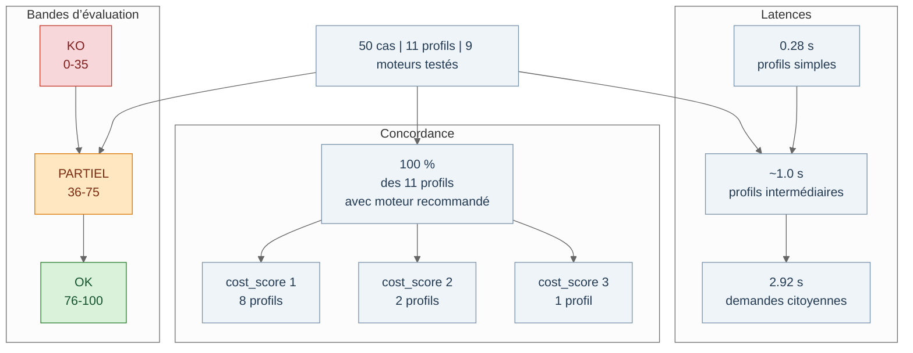

# CoVeX - Completeness Verification eXpert

**Auteur :** Julien Burdy
**Cadre :** T.CAS en Intelligence artificielle (IA) appliquée en entreprise
**Date :** Mars 2026

---
CoVeX répond à un enjeu critique des organisations : la dette informationnelle causée par des saisies textuelles incomplètes ou mal contextualisées, limitant leur exploitation future. En se concentrant sur la qualité des données plutôt que leur forme, le prototype utilise des profils métier explicites et une évaluation automatisée pour détecter les lacunes de complétude. Son approche privilégie l'accompagnement via une API intégrable, évitant d'alourdir le processus de saisie pour l'utilisateur final.


## Table des matières

- [1. Contexte et cadrage](#1-contexte-et-cadrage)
  - [1.1 Introduction et enjeu](#11-introduction-et-enjeu)
  - [1.2 Positionnement de CoVeX](#12-positionnement-de-covex)
  - [1.3 Problématique](#13-problématique)
  - [1.4 Objectifs et périmètre](#14-objectifs-et-périmètre)
  - [1.5 Démarche méthodologique](#15-démarche-méthodologique)
- [2. Solution et implémentation](#2-solution-et-implémentation)
  - [2.1 Solution proposée](#21-solution-proposée)
  - [2.2 Conception détaillée et implémentation](#22-conception-détaillée-et-implémentation)
    - [2.2.1 Profils d’analyse comme levier métier](#221-profils-danalyse-comme-levier-métier)
    - [2.2.2 Prompt final et few-shot prompting](#222-prompt-final-et-few-shot-prompting)
    - [2.2.3 Scoring et pondération](#223-scoring-et-pondération)
    - [2.2.4 Usage du score et risque de blocage](#224-usage-du-score-et-risque-de-blocage)
    - [2.2.5 LangExtract](#225-langextract)
    - [2.2.6 Choix et optimisation des moteurs](#226-choix-et-optimisation-des-moteurs)
  - [2.3 Implémentation](#23-implémentation)
- [3. Résultats et discussion](#3-résultats-et-discussion)
  - [3.1 Évaluation par le golden dataset](#31-évaluation-par-le-golden-dataset)
  - [3.2 Retour critique sur le scoring et la pondération](#32-retour-critique-sur-le-scoring-et-la-pondération)
  - [3.3 Non-déterminisme des LLM](#33-non-déterminisme-des-llm)
  - [3.4 Maîtrise des coûts d’inférence](#34-maîtrise-des-coûts-dinférence)
  - [3.5 Ajustements, renoncements et enseignements](#35-ajustements-renoncements-et-enseignements)
- [4. Conclusion](#4-conclusion)
- [5. Bibliographie](#5-bibliographie)
- [Annexes](#annexes)

---

## 1. Contexte et cadrage

### 1.1 Introduction et enjeu

Les organisations accumulent des volumes croissants de données textuelles non structurées : comptes-rendus d’intervention, demandes d’achat, rapports de chantier, demandes citoyennes, tickets de support. Cette production constitue un capital informationnel considérable, mais sa qualité variable entrave son exploitation ultérieure. Une saisie incomplète ou dépourvue de contexte pertinent engendre des cycles de clarification redondants, des erreurs de traitement en aval et une perte irréversible d’information exploitable. Cette **dette informationnelle**, accumulée à la source, se traduit par des coûts opérationnels importants et limite les possibilités de réutilisation des données pour l’analytique, la gouvernance, les bases de connaissance (le RAG) ou la traçabilité a posteriori, dans une perspective plus large de qualité des données (Lukyanenko 2025 ; Upside Staff 2022).

Les systèmes d’information des PME sont particulièrement exposés : les collaborateurs saisissent souvent rapidement, sans directives strictes, dans des formulaires minimalistes. Il en résulte une masse de données brutes dont seule une fraction est directement exploitable. La requalification a posteriori s’avère coûteuse, rarement priorisée ou tout simplement impossible : lorsqu’une information n’a pas été saisie au moment des faits, elle peut être définitivement perdue, parce que les détails ont été oubliés ou parce que la personne à l’origine du savoir n’est plus accessible par l’organisation. Le défi consiste donc à intervenir dès la création de la donnée, sans alourdir le processus de saisie ni déporter la charge cognitive vers l’utilisateur.

Les principaux acronymes et termes techniques utilisés dans le rapport sont définis en [annexe GLO : Glossaire](./CoVeX-2-annexes.md#annexe-glo).


### 1.2 Positionnement de CoVeX

CoVeX (Completeness Verification eXpert) est un prototype conçu pour répondre à cette problématique. Il propose une analyse de la complétude des saisies textuelles, basée sur des profils métier explicites. Le système évalue la **qualité du fond** (présence des informations attendues selon le contexte métier) plutôt que la forme (orthographe, syntaxe, style). Il détecte les éléments manquants et justifie son diagnostic. Conçu comme un service, CoVeX s’intègre en amont du flux de données : derrière un ERP, un formulaire web, un système de ticketing, un chat ou tout autre point de saisie. L’utilisateur final n’interagit pas directement avec CoVeX ; c’est le système applicatif appelant qui exploite le résultat pour valider, rejeter ou décrire les manquements à l’utilisateur.

Le cadrage documentaire du projet s’organise autour de trois ensembles de travaux. Le premier porte sur la qualité et la complétude des données, qui permettent de situer le problème au-delà de la simple saisie textuelle et de l’inscrire dans une réflexion plus large sur la valeur informationnelle des données (Lukyanenko 2025 ; Upside Staff 2022). Le deuxième concerne les mécanismes techniques mobilisables pour guider un LLM sans fine-tuning, en particulier le few-shot prompting et l’extraction structurée (Brown et al. 2020 ; Goel et al. 2025). Le troisième regroupe les limites de fiabilité et de reproductibilité qui empêchent de traiter un score LLM comme une vérité absolue et justifient un positionnement d’aide à la décision plutôt que de blocage automatique (Atil et al. 2025).

Son positionnement par rapport aux approches voisines est détaillé en [annexe SOL : Solutions proches](./CoVeX-2-annexes.md#annexe-sol).

### 1.3 Problématique

L’amélioration de la complétude des saisies textuelles se heurte à une quadruple tension. 

**Premièrement**, la complétude ne se réduit pas à un comptage de mots ou de champs : elle dépend du contexte métier, de l’objectif de la saisie et du niveau de précision attendu. Un ticket IT nécessite un symptôme, un contexte technique et une indication d’urgence ; une demande d’achat requiert un article identifié, une quantité, une justification et un budget. Ces critères sont par nature domaine-spécifiques et ne se prêtent pas à une vérification purement syntaxique.

**Deuxièmement**, l’intervention à la source doit être efficiente. Multiplier les champs obligatoires, complexifier les formulaires ou ajouter des étapes de validation alourdit le parcours utilisateur et génère résistance ou contournement. L’enjeu est d’apporter une valeur immédiate - détection des lacunes, suggestions correctives - sans pénaliser la fluidité de saisie.

**Troisièmement**, la souveraineté des données constitue une exigence légitime. Les données textuelles des entreprises contiennent souvent des informations sensibles : opérations internes, relations clients, incidents techniques. L’externalisation vers des services cloud pose des questions de confidentialité et de dépendance. La possibilité d’utiliser des modèles locaux ou maîtrisés présente un avantage à la fois compétitif et éthique (cf. [annexe LOC : Modèles locaux](./CoVeX-2-annexes.md#annexe-loc)).

**Quatrièmement**, la charge cognitive ne doit pas être reportée sur l’utilisateur par des exigences immédiates ou un blocage systématique. Selon le contexte, une saisie initiale incomplète peut être acceptée pour ne pas interrompre l’activité, tandis qu’une alerte est levée en arrière-plan par le système applicatif. Les éléments manquants peuvent alors faire l’objet d’une demande différée, par exemple via une relance ciblée ou un courriel automatique. Alternativement, l’interface peut simplement signaler le score insuffisant et demander à l’utilisateur de confirmer qu’il n’a rien à ajouter. L’objectif est d’accompagner la saisie par des mécanismes de correction proportionnés, sans exiger de l’utilisateur qu’il devienne un expert des critères de complétude.

### 1.4 Objectifs et périmètre

Les objectifs du projet s’articulent sur trois plans. 

Sur le **plan métier**, CoVeX vise à fournir un prototype fonctionnel capable de détecter les lacunes de complétude, de calculer un score pondéré sur 100 et de produire une justification lisible. Le système est intégrable par API, avec un contrat HTTP stabilisé (`POST /analyze` retournant score, décision, justification, éléments couverts, éléments manquants et extractions). 

Sur le **plan technique**, le prototype repose sur une architecture modulaire séparée entre un backend FastAPI (Ramírez 2018) et une interface de démonstration NiceGUI (Zauberzeug GmbH 2022), une configuration des profils en YAML et une abstraction des moteurs d’inférence **modèle/provider agnostique** permettant d’interchanger des modèles locaux et distants. 

Sur le **plan méthodologique**, le projet documente les arbitrages techniques, s’appuie sur un golden dataset et permet une évaluation comparative des moteurs (cf. [annexe MOT : Sélection des moteurs](./CoVeX-2-annexes.md#annexe-mot)).

Le périmètre réel du prototype se limite à l’analyse de textes en langue française, pour des domaines métier explicitement configurés. Le prototype n’implémente pas de routage automatique des profils : l’appelant doit fournir un `profile_id` explicite. Il n’y a ni authentification, ni persistance utilisateur, ni base de données. Les interactions avec les moteurs d’inférence sont synchrones. Les comparaisons entre SLM et LLM constituent des pistes exploratoires relevant de l’annexe ou des perspectives, non le centre du prototype livré. Le projet reste donc concentré sur la clarté du flux d’analyse et la qualité des profils, plutôt que sur une architecture produit complète.

### 1.5 Démarche méthodologique

Le projet adopte une démarche mixte, articulant cadrage académique et réalisation technique itérative. Cette approche se justifie par la nature même du sujet : la complétude des saisies textuelles est un problème empirique, qui ne se résout ni par la seule théorie ni par un développement purement technique. La confrontation continue entre hypothèses de cadrage et retours d’implémentation a permis d’affiner les profils, d’ajuster les critères et de documenter les écarts entre intention initiale et réalité du prototype.

Le **premier pilier** méthodologique est la constitution du golden dataset, composé de cinquante cas couvrant onze profils (cf. [annexe GDS : Golden dataset](./CoVeX-2-annexes.md#annexe-gds)). Ce corpus sert de base à l’évaluation, à la démonstration et à la construction des exemples de few-shot prompting. La diversité des cas - du ticket IT minimal au rapport qualité industriel détaillé - garantit un test sur des registres de langue et des exigences métier contrastés.

Le **deuxième pilier** est la définition explicite des critères de complétude par profil métier. Chaque profil décrit des `coverage_item` avec des poids relatifs, des descriptions d’information attendue et des exemples d’extraction. Cette formalisation transforme une expertise métier implicite en spécifications vérifiables. Le few-shot prompting (Brown et al. 2020) guide le modèle vers les extractions pertinentes par l’exemple plutôt que par des règles procédurales ; la qualité de ces exemples constitue le principal levier actionnable, développé en section 2.2.2.

Le **troisième pilier** est l’évaluation comparative des moteurs d’inférence. Le prototype permet de tester différents modèles - locaux ou distants - sur un même jeu de données, de mesurer les taux de concordance avec les décisions attendues et d’identifier les cas problématiques. Cette approche pragmatique alimente les arbitrages techniques et documente les compromis entre coût, latence et qualité d’extraction.

La démarche intègre un double cadrage méthodologique : le projet traite simultanément la conception du prototype CoVeX et l’utilisation des agents IA comme outils de travail pour le projet lui-même[^ia]. Ce choix reconnaît que la construction d’un prototype moderne s’appuie désormais sur des pratiques de développement assisté par IA, et que cette intégration mérite d’être documentée et évaluée au même titre que les choix d’architecture. La méthode BMad a été employée pour structurer les phases d’analyse et de planification du projet, dont le détail fait l’objet des [annexes BMD : Méthode BMad](./CoVeX-2-annexes.md#annexe-bmd) et [IAG : IA générative](./CoVeX-2-annexes.md#annexe-iag).


## 2. Solution et implémentation

### 2.1 Solution proposée

L’architecture et la conception détaillée de CoVeX traduisent les objectifs et la démarche exposés précédemment en un prototype fonctionnel. Le système reçoit en entrée un texte libre et un identifiant de profil (`profile_id`) ; il retourne un score sur 100, une décision (`OK`, `PARTIEL`, `KO`), la liste des éléments couverts et manquants, les extractions détaillées du modèle et des métadonnées techniques (latence, modèle utilisé). L’architecture repose sur trois couches : 

1) la configuration déclarative des profils et des moteurs en YAML
1) le backend FastAPI qui orchestre l’analyse
1) un playground servant exclusivement de support de démonstration et de validation des profils

**Exemple d’appel:**
```bash
http POST http://127.0.0.1:8000/analyze \
  text="Je souhaite commander 5 licences de logiciel XYZ pour l’équipe marketing." \
  profile_id=demandes_achat
```

**Réponse:**
```json
{
    "score": 60,
    "decision": "PARTIEL",
    "justification": "Elements manquants : ref_financiere, delai_urgence",    
    "covered_elements": [
        "article",
        "justification",
        "quantite_explicite"
    ],
    "missing_elements": [
        "ref_financiere",
        "delai_urgence"
    ],
    "extractions": [
        {
            "class": "covered_criterion",
            "criterion_id": "article",
            "text": "5 licences de logiciel XYZ"
        },
        {
            "class": "covered_criterion",
            "criterion_id": "quantite_explicite",
            "text": "5"
        },
        {
            "class": "covered_criterion",
            "criterion_id": "justification",
            "text": "pour l’équipe marketing"
        }
    ],
    "latency_sec": 0.26590637499975855,
    "model_used": "llama-3.1-8b-instant",
    "profile_used": "demandes_achat",
}
```

<!-- VISUEL-TODO
id:      r-arch-globale
type:    infographique NotebookLM
label:   Architecture globale de CoVeX
source:  section 2.1, paragraphe principal decrivant les trois couches (configuration YAML, backend FastAPI, playground NiceGUI) et le flux entree/sortie
prompt:  Génère un infographique illustrant l’architecture en trois couches de CoVeX (Configuration déclarative, Backend FastAPI, Playground NiceGUI) et le flux d’entrée/sortie. Base-toi sur les informations du rapport.md et de son annexe.md.
-->



### 2.2 Conception détaillée et implémentation

#### 2.2.1 Profils d’analyse comme levier métier

Le prototype couvre onze profils métier distincts -- tickets support IT, demandes d’achat, comptes-rendus d’intervention, demandes citoyennes, devis construction, rapports de chantier, suivi scolaire, absences RH, suivi projet, évolutions produit et validation qualité -- chacun définissant des critères de complétude spécifiques avec poids relatifs et exemples de few-shot prompting.

Le fichier `config/analysis_profiles.yaml` constitue le coeur configurable de CoVeX. Chaque profil décrit un domaine métier à travers quatre composantes : 
1) un nom et une description contextuelle
1) une liste de `coverage_item` définissant les critères de complétude
1) des exemples `le_few_shot` guidant le modèle
1) une liaison vers un moteur d’inférence via `inference_engine_key`

Chaque `coverage_item` porte:
- un `id` (identifiant du critère)
- un `expected_info` (description de l’information attendue)
- un `weight` (poids relatif dans le score). 

Un utilisateur expert paramètre ses propres profils en adaptant ces trois champs à son domaine. Pour un profil de validation qualité industrielle, par exemple, le critère `quantification_seuil` pèse 0.45 du score - reflétant l’importance décisive des mesures chiffrées dans ce contexte - tandis que l’identification du lot ne pèse que 0.10 (cf. [annexe EXA : Exemples d’analyse](./CoVeX-2-annexes.md#annexe-exa)). Cette pondération traduit directement une expertise métier en logique d’évaluation. L’architecture est entièrement déclarative : ajouter un domaine métier revient à ajouter une entrée YAML, sans modification de code.

#### 2.2.2 Prompt final et few-shot prompting

Le mécanisme de prompt repose sur le concept de few-shot prompting (Brown et al. 2020) : fournir au modèle quelques exemples entrée/sortie directement dans le prompt pour guider son comportement sans fine-tuning. CoVeX exploite cette technique via les exemples `le_few_shot` (LangExtract few-shot) de chaque profil. Chaque exemple associe un texte d’entrée à une liste d’extractions attendues (`criterion_id` + `extraction_text`), montrant au modèle ce qu’il doit identifier et sous quelle forme.

Le prompt final est assemblé dynamiquement par le module `analysis_profiles_config`. Il combine le nom du profil, sa description, l’objectif d’analyse et la liste des critères avec leurs poids et descriptions. Ce template est ensuite transmis au module d’inférence, qui le complète avec les exemples few-shot et le texte à analyser via le système de templates structurés de LangExtract (Goel et al. 2025). Le format de sortie attendu est un JSON structuré contenant les extractions, chacune rattachée à un `criterion_id` par un système d’attributs.

La qualité, la diversité et la représentativité des exemples few-shot conditionnent directement la pertinence de l’analyse. C’est le principal levier actionnable par l’utilisateur expert : un profil avec des exemples bien choisis - couvrant les cas nominaux, les cas limites et les absences - produira des résultats nettement plus fiables qu’un profil avec des exemples génériques.

<!-- VISUEL-TODO
id:      r-assemblage-prompt
label:   Assemblage du prompt final et chaine d’inference
type:    infographique NotebookLM
source:  section 2.2.2, description du mecanisme de prompt et de l’interaction avec LangExtract
prompt:  Génère un infographique montrant le flux d’assemblage du prompt final, depuis les quatre sources (profil, critères, exemples few-shot, texte) jusqu’à la réponse structurée AnnotatedDocument, en passant par le module de configuration, LangExtract et le moteur d’inférence. Base-toi sur les informations du rapport.md et de son annexe.md.
-->



#### 2.2.3 Scoring et pondération

Le score de complétude est calculé sur 100 à partir des poids des critères couverts. Le backend somme les poids des `coverage_item` dont l’identifiant apparaît dans les extractions retournées par le modèle, puis divise par le poids total. Le résultat est arrondi et borné entre 0 et 100. La décision découle du score et de la présence d’éléments manquants : `KO` si le score est inférieur ou égal à 30, `OK` uniquement si le score dépasse 70 et qu’aucun élément n’est manquant, `PARTIEL` dans tous les autres cas. Cette logique à trois niveaux offre un signal lisible sans fausse précision.

Le score n’est pas une mesure absolue de qualité rédactionnelle : il reflète la couverture des critères métier tels que définis dans le profil. Sa lecture appelle donc une prudence contextuelle - un score de 60 dans un profil exigeant (validation qualité, cinq critères fortement pondérés) ne traduit pas le même niveau de lacune qu’un score de 60 dans un profil plus souple.

<!-- VISUEL-TODO
id:      r-scoring-decision
label:   Logique de scoring et seuils de decision
type:    infographique NotebookLM
source:  section 2.2.3, description du calcul du score et des trois niveaux de decision
prompt:  Génère un infographique combinant le schéma de calcul du score pondéré et l’arbre/échelle de décision avec les trois zones (KO, PARTIEL, OK) et la condition pour être OK. Base-toi sur les informations du rapport.md et de son annexe.md.
-->



#### 2.2.4 Usage du score et risque de blocage

Le système appelant peut techniquement utiliser le score pour bloquer une saisie jugée incomplète - refuser la soumission en dessous d’un seuil, par exemple. Toutefois, cette utilisation est risquée et déconseillée : les LLM sont non déterministes et les extractions restent faillibles, ce qui rend les faux positifs inévitables. Un blocage injustifié dégrade l’expérience utilisateur et peut entraîner un rejet du système.

CoVeX se positionne donc comme un outil d’aide et de sensibilisation - signaler, suggérer, informer - plutôt que comme un garde-barrière automatique. Un éventuel blocage ne devrait être envisagé qu’après une phase de rodage approfondie, sur des profils stabilisés, et avec des mécanismes de recours explicites pour l’utilisateur.

Des modes d’intégration concrets correspondant à ces choix sont illustrés en [annexe SCN : Scénarios d’usage](./CoVeX-2-annexes.md#annexe-scn).

#### 2.2.5 LangExtract

LangExtract (Goel et al. 2025) est la bibliothèque d’extraction structurée qui constitue le composant central de l’interface entre CoVeX et les LLM. Son apport essentiel est de prendre en charge trois responsabilités qui, sans elle, devraient être implémentées manuellement : l’assemblage du prompt final avec les exemples few-shot, l’imposition d’un format de sortie JSON structuré, et le parsing normalisé des réponses quelle que soit la syntaxe retournée par le fournisseur. Cette abstraction réduit significativement la surface d’erreur dans un système devant fonctionner avec plusieurs moteurs hétérogènes (Groq, OpenRouter, Ollama).

**Flux d’extraction.** Le module d’inférence de CoVeX convertit les exemples few-shot du profil en objets `lx.data.ExampleData`. Chaque extraction est typée avec une `extraction_class` fixée en dur à `"covered_criterion"` et un attribut `criterion_id` rattachant l’extraction au critère métier correspondant. LangExtract assemble ensuite le prompt via `PromptTemplateStructured` et `QAPromptGenerator`, en injectant la description du profil, les exemples et le texte à analyser. Le `FormatHandler` enveloppe la réponse attendue sous la clé JSON `extractions`, garantissant la cohérence du format entre les exemples fournis et la sortie produite. L’appel `lx.extract()` retourne un `AnnotatedDocument` dont les extractions - chacune portant sa classe, son texte extrait et son `criterion_id` - permettent au backend de dresser la liste des `coverage_item` couverts et manquants.

**Paramétrage explicite vs défauts.** Deux paramètres de `lx.extract()` ont été désactivés explicitement. `use_schema_constraints=False` : LangExtract peut valider la réponse JSON contre un schéma strict, mais les critères varient à chaque profil - régénérer ce schéma à chaque requête aurait ajouté de la complexité sans apport, la validation Pydantic du backend étant suffisante. `prompt_validation_level=OFF` : LangExtract peut inspecter le prompt avant envoi pour détecter des incohérences ; désactivé ici pour éviter une latence non justifiée sur des profils déjà validés au chargement. La température est fixée à `0.0` pour maximiser la reproductibilité. `max_tokens` n’est pas transmis. Le champ `char_interval`, qui renseigne la position des extractions dans le texte source, n’est pas non plus renseigné : CoVeX n’a pas besoin de localiser les fragments extraits, et l’omettre simplifie la construction des objets `Extraction`.

**Limite : opacité de la réponse brute.** LangExtract n’expose pas le contenu brut de la réponse du fournisseur ni les compteurs de tokens via son API publique. CoVeX documente cette contrainte dans la trace. Elle est sans conséquence pour le diagnostic de complétude, mais elle limite les possibilités de supervision fine des coûts réels d’inférence par requête.

#### 2.2.6 Choix et optimisation des moteurs

Le catalogue des moteurs est défini dans `config/inference_engines.yaml`. Chaque entrée précise:
- un `type` (local ou distant)
- un `model`
- un `cost_score` relatif
- un `base_url`
- un `auth_env_var`. 

Le `cost_score` est une abstraction interne permettant de piloter le compromis performance/coût sans exposer les tarifs bruts des fournisseurs. Le catalogue suit la même logique déclarative que les profils : une nouvelle entrée YAML suffit à rendre un moteur disponible, sans modification de code.

La liaison entre profil et moteur s’effectue via `inference_engine_key` dans le profil d’analyse. Cette indirection permet d’adapter la puissance du modèle à la complexité du domaine : un profil de demandes citoyennes, plus exigeant en compréhension contextuelle, utilise un moteur plus capable (`remote_openrouter_mistral_small_32_24b`) que les profils de tickets IT, satisfaits par le moteur le moins coûteux et très rapide (`remote_groq_llama31_8b_instant`).

La sélection des moteurs a fait l’objet d’une démarche comparative outillée, dont les résultats complets figurent en annexe (cf. [annexe MOT : Sélection des moteurs](./CoVeX-2-annexes.md#annexe-mot)). Le script d’évaluation a testé neuf moteurs sur les onze profils, comparant taux de concordance avec les bandes attendues du golden dataset, latence moyenne et `cost_score`.

<!-- VISUEL-TODO
id:      r-affectation-moteurs
label:   Affectation des moteurs par profil et niveau de cout
type:    infographique NotebookLM
source:  section 2.2.6, resultats de la demarche comparative (8 profils sur cost_score 1, 2 sur cost_score 2, 1 sur cost_score 3)
prompt:  Génère un infographique montrant l’affectation des onze profils d’analyse aux trois niveaux de coût (cost_score), incluant les informations de concordance et de latence moyenne. Base-toi sur les informations du rapport.md et de son annexe.md.
-->



### 2.3 Implémentation

Le prototype est organisé en monorepo Python avec deux packages distincts. Le backend FastAPI comprend quatre modules principaux : `main.py` pour l’assemblage de l’application, `analysis.py` pour l’orchestration et le calcul du score, `inference.py` pour la résolution des moteurs et l’appel LangExtract, et `analysis_profiles_config.py` pour le chargement des profils. Les schémas d’entrée et de sortie sont définis avec Pydantic (Colvin et al. 2017) (`ConfigDict(extra="forbid")`, contraintes `Field`), garantissant un rejet strict des requêtes mal formées et une documentation automatique du contrat API. Cette validation est précieuse dans un système combinant données utilisateur, configuration YAML et réponses de LLM aux formats potentiellement imprévisibles.

Les logs de développement constituent un outil essentiel de diagnostic. Le backend produit deux catégories de journaux : les logs applicatifs traçant requêtes, erreurs et décisions, et les traces détaillées d’analyse consignant le prompt envoyé, la réponse brute du modèle, les extractions normalisées et le résumé de couverture. En développement, ces traces sont systématiquement émises ; en production, elles dépendent de `COVEX_PROMPT_TRACE_ENABLED`. Ces journaux ont été décisifs pour itérer sur les profils et diagnostiquer les comportements inattendus des modèles.

Les aspects pratiques d’installation, de lancement et de validation rapide sont regroupés en [annexe INS : Installation et validation](./CoVeX-2-annexes.md#annexe-ins).

<!-- VISUEL-TODO
id:      r-modules-backend
label:   Organisation modulaire du backend
type:    infographique NotebookLM
source:  section 2.3, description des quatre modules principaux et de leurs responsabilites
prompt:  Génère un infographique illustrant l’organisation modulaire du backend (main.py, analysis.py, inference.py, analysis_profiles_config.py) ainsi que les interactions avec les éléments externes (YAML, modèles, Pydantic). Base-toi sur les informations du rapport.md et de son annexe.md.
-->



## 3. Résultats et discussion

L’architecture et les mécanismes décrits précédemment étant posés, cette partie en évalue les résultats empiriques et en discute les limites. Les résultats présentés concernent un service API intégrable, évalué sur un corpus de référence et non sur un déploiement en conditions de production.

### 3.1 Évaluation par le golden dataset

Le golden dataset constitue la pièce centrale de l’évaluation empirique de CoVeX (cf. [annexe GDS : Golden dataset](./CoVeX-2-annexes.md#annexe-gds)). L’évaluation comparative a porté sur neuf moteurs d’inférence testés systématiquement sur l’ensemble des profils. Le critère principal est le taux de concordance : pour chaque cas, le score produit par le moteur doit rester dans la bande d’évaluation attendue, et donc conduire à la décision visée. Les résultats montrent que les onze profils atteignent 100 % de concordance avec le moteur recommandé. Pour huit profils sur onze, le moteur le moins coûteux (`cost_score` 1, LLaMA 3.1 8B) suffit. Deux profils nécessitent un moteur intermédiaire (`cost_score` 2), et un seul - les demandes citoyennes, plus exigeantes en compréhension contextuelle - requiert un modèle plus puissant (`cost_score` 3, Mistral Small 24B). Les latences moyennes s’échelonnent de 0,28 seconde pour les profils les plus simples à 2,92 secondes pour le profil le plus exigeant (cf. [annexe EXA : Exemples d’analyse](./CoVeX-2-annexes.md#annexe-exa)), confirmant la compatibilité avec un usage en temps quasi réel derrière un formulaire ou un ERP.

Ces résultats appellent toutefois une lecture prudente. Le golden dataset, bien que soigneusement construit, reste un corpus limité en volume. Cinquante cas ne couvrent pas l’ensemble des variations linguistiques, des cas limites ni des ambiguïtés réelles. Le taux de concordance mesure la cohérence entre les décisions du modèle et les décisions attendues par l’auteur du dataset - il ne constitue pas une mesure absolue de qualité. Les bandes d’évaluation retenues pour la comparaison (0-35 pour KO, 36-75 pour PARTIEL, 76-100 pour OK) introduisent une tolérance utile pour comparer les moteurs, mais elles lissent les écarts fins entre deux scores proches.

<!-- VISUEL-TODO
id:      r-synthese-evaluation
label:   Synthese des resultats d’evaluation par le golden dataset
type:    infographique NotebookLM
source:  section 3.1, resultats de l’evaluation comparative (concordance, latences, repartition des moteurs par profil)
prompt:  Génère un infographique de synthèse des résultats d’évaluation, incluant les taux de concordance, les plages de latences, et les bandes d’évaluation, en rappelant le contexte (50 cas, 11 profils, 9 moteurs). Base-toi sur les informations du rapport.md et de son annexe.md.
-->



### 3.2 Retour critique sur le scoring et la pondération

Le score pondéré sur 100 remplit sa fonction première : fournir un signal lisible au système appelant. La pondération des critères traduit une expertise métier en logique d’évaluation - un critère pesant 0,45 du score pèse effectivement sur la décision finale. Cette transparence est un atout pour la crédibilité du diagnostic auprès des utilisateurs experts qui paramètrent les profils.

La limite principale réside dans la dépendance totale du score à la qualité des extractions du modèle. Si le LLM ne détecte pas un élément pourtant présent dans le texte, le score chute sans que le texte soit réellement incomplet. Inversement, une extraction trop généreuse peut gonfler le score. Le scoring ne mesure donc pas directement la complétude du texte, mais la capacité du modèle à en extraire les éléments attendus selon les critères du profil. Cette distinction, essentielle pour interpréter les résultats, justifie le positionnement de CoVeX comme outil d’aide plutôt que comme mécanisme de blocage automatique.

### 3.3 Non-déterminisme des LLM

Le caractère non déterministe des modèles de langage constitue une limite méthodologique importante. Deux appels identiques - même texte, même profil, même moteur - peuvent produire des extractions différentes et, par conséquent, des scores et des décisions divergents. Cette variabilité, documentée dans la littérature (Atil et al. 2025), découle de mécanismes internes aux fournisseurs (optimisations GPU, batching, précision flottante) que l’appelant ne contrôle pas.

Les précautions prises dans CoVeX - température fixée à zéro, extraction structurée via LangExtract, few-shot prompting de qualité - réduisent la variance observable sans l’éliminer. Les conséquences sont directes : la reproductibilité stricte des résultats n’est pas garantie, ce qui limite la valeur probante d’un score isolé et renforce la recommandation de ne pas utiliser CoVeX comme mécanisme de blocage automatique.

### 3.4 Maîtrise des coûts d’inférence

La stratégie d’affectation du moteur le moins cher capable d’atteindre 100 % de concordance, détaillée en annexe (cf. [annexe MOT : Sélection des moteurs](./CoVeX-2-annexes.md#annexe-mot)), a permis de contenir les coûts d’inférence sans sacrifier la qualité. La répartition finale privilégie très majoritairement le niveau `cost_score` 1, ce qui rend le coût marginal pour la plupart des appels. Ce résultat renforce la viabilité économique d’un déploiement en production.

### 3.5 Ajustements, renoncements et enseignements

Le retrait du routage automatique des profils illustre un enseignement méthodologique récurrent : simplifier un prototype en supprimant une fonctionnalité déjà codée peut constituer un progrès. Dans le cas présent, ce mécanisme imposait une classification fiable du texte en amont, ajoutait une couche d’inférence supplémentaire, augmentait la surface d’erreur et introduisait une latence peu justifiée alors même que le système appelant connaît généralement la nature de la saisie.

Parmi les autres notions finalement écartées après implémentation :

- la reconfiguration sans redémarrage
- le fallback automatique vers un moteur secondaire
- la couche d’extraction distincte du flux d’analyse principal
- l’exposition des compteurs de tokens dans la réponse API et l’interface de démonstration
- le paramétrage explicite de la température d’inférence

L’adoption de LangExtract relève du même apprentissage progressif. Dans les premières itérations, sur un corpus plus réduit, les prompts seuls suffisaient pour guider le modèle et récupérer des sorties exploitables. Son intégration ne s’est imposée qu’avec l’enrichissement du golden dataset : la diversité croissante des profils, l’apparition de cas limites et la complexification des exemples ont rendu plus fragile un assemblage et un parsing ad hoc des réponses. Le passage à LangExtract correspond ainsi moins à une sophistication recherchée qu’à un besoin de robustesse face à un corpus devenu plus exigeant.

Cette évolution n’a toutefois pas modifié la finalité de CoVeX. L’extraction n’est pas un but en soi : le coeur du prototype reste l’évaluation de la complétude. En revanche, dès lors que LangExtract fournissait déjà des extractions structurées utiles, il aurait été artificiel de ne pas permettre leur exploitation par le système appelant. Leur exposition dans la réponse enrichit l’explication du diagnostic et ouvre des usages complémentaires sans détourner CoVeX de son objectif principal.

D’autres ajustements ont également ponctué le développement : refactoring des schémas Pydantic pour imposer une validation stricte, mise de côté de plusieurs essais sur modèles locaux durant le travail afin d’accélérer les itérations et de libérer les ressources limitées du MacBook Air utilisé pour le projet (cf. [annexe LOC : Modèles locaux](./CoVeX-2-annexes.md#annexe-loc)), et itérations multiples sur les exemples few-shot. L’ensemble confirme la valeur d’une démarche itérative, dans laquelle le retour empirique corrige utilement l’intention initiale.

## 4. Conclusion

CoVeX démontre qu’une analyse automatique de la complétude des saisies textuelles, fondée sur des profils métier explicites et pilotée par le few-shot prompting, est techniquement réalisable et pratiquement exploitable. Le prototype répond à la problématique initiale - améliorer la qualité des données à la source, sans alourdir la charge cognitive de l’utilisateur - en fournissant un diagnostic structuré, pondéré et justifié, intégrable par API dans les systèmes d’information existants.

Les résultats de l’évaluation empirique confirment la viabilité de l’approche : onze profils couverts, 100 % de concordance avec les décisions attendues sur le golden dataset pour chaque moteur recommandé, et des coûts d’inférence maîtrisés grâce à l’utilisation de modèles compacts sur la majorité des cas. La configuration déclarative en YAML permet d’ajouter un domaine métier sans modification de code, rendant le système extensible par des experts métier.

Les limites identifiées - non-déterminisme des LLM, dépendance du score à la qualité des extractions, taille limitée du corpus de validation - ne remettent pas en cause l’utilité du prototype mais délimitent son périmètre d’usage responsable. CoVeX se positionne comme un outil d’aide et de sensibilisation, non comme un mécanisme de blocage automatique. Un éventuel usage bloquant nécessiterait une phase de rodage approfondie, des seuils conservateurs et des mécanismes de recours explicites.

Le principal enseignement méthodologique du projet est la valeur de l’ajustement progressif. Retirer le routage automatique, n’introduire LangExtract qu’au moment où l’enrichissement du corpus l’a réellement justifié, privilégier des modèles compacts et maintenir un contrat API minimal ont produit un prototype plus fiable et plus lisible que les ambitions initiales ne le laissaient présager. La dette informationnelle des PME reste un problème structurel ; CoVeX propose une réponse ciblée, intégrable et économiquement viable à la fraction de ce problème qui relève de la complétude des saisies.

[^ia]: Des agents IA ont été utilisés comme outils d’assistance pour le cadrage, la structuration, la reformulation et certaines phases d’analyse du projet ; leur rôle et leurs limites sont documentés dans l’[annexe IAG : IA générative](./CoVeX-2-annexes.md#annexe-iag). Conformément au guide REF, cette contribution est créditée en note et n’est pas intégrée à la bibliographie comme un document source.

## 5. Bibliographie

ATIL, Berk et al., 2025. Non-Determinism of "Deterministic" LLM Settings [en ligne]. arXiv. DOI 10.48550/arXiv.2408.04667.

BROWN, Tom B. et al., 2020. Language Models are Few-Shot Learners [en ligne]. arXiv. DOI 10.48550/arXiv.2005.14165.

COLVIN, Samuel et al., 2017. Pydantic: data validation using Python type hints [en ligne]. Pydantic Validation. Disponible à l’adresse : https://docs.pydantic.dev/ [consulté le 30 mars 2026].

GOEL, Aakanksha et al., 2025. LangExtract: a Python library for extracting structured information from unstructured text using LLMs with precise source grounding and interactive visualization [en ligne]. Google. DOI 10.5281/zenodo.17015089. Disponible à l’adresse : https://github.com/google/langextract [consulté le 30 mars 2026].

LUKYANENKO, Roman, 2025. What is Data Quality? Defining Data Quality in the Age of AI [en ligne]. HAL open science. Disponible à l’adresse : https://hal.science/hal-05028055 [consulté le 30 mars 2026].

RAMÍREZ, Sebastian, 2018. FastAPI [en ligne]. FastAPI. Disponible à l’adresse : https://fastapi.tiangolo.com/ [consulté le 30 mars 2026].

UPSIDE STAFF, 2022. The hidden cost of bad data [en ligne]. Upside. Disponible à l’adresse : https://upsideai.com/the-hidden-cost-of-bad-data/ [consulté le 30 mars 2026].

ZAUBERZEUG GMBH, 2022. NiceGUI: create web-based user interfaces with Python [en ligne]. NiceGUI. Disponible à l’adresse : https://nicegui.io/ [consulté le 30 mars 2026].

---

## Annexes

- [IAG : IA générative](./CoVeX-2-annexes.md#annexe-iag)
- [BMD : Méthode BMad](./CoVeX-2-annexes.md#annexe-bmd)
- [INS : Installation et validation](./CoVeX-2-annexes.md#annexe-ins)
- [SCN : Scénarios d’usage](./CoVeX-2-annexes.md#annexe-scn)
- [GDS : Golden dataset](./CoVeX-2-annexes.md#annexe-gds)
- [MOT : Sélection des moteurs](./CoVeX-2-annexes.md#annexe-mot)
- [LOC : Modèles locaux](./CoVeX-2-annexes.md#annexe-loc)
- [EXA : Exemples d’analyse](./CoVeX-2-annexes.md#annexe-exa)
- [SOL : Solutions proches](./CoVeX-2-annexes.md#annexe-sol)
- [GLO : Glossaire](./CoVeX-2-annexes.md#annexe-glo)

<!-- Annexe SOL : Solutions proches - référencée dans le corps (section 1.2) -->
<!-- Annexe BMD : Méthode BMad - référencée dans le corps (section 1.5) -->
<!-- Annexe IAG : IA générative - référencée dans le corps (section 1.5) -->
<!-- Annexe INS : Installation et validation - référencée dans le corps (section 2.3) -->
<!-- Annexe SCN : Scénarios d’usage - référencée dans le corps (section 2.2.4) -->
<!-- Annexe GDS : Golden dataset - référencée dans le corps (sections 1.5, 3.1) -->
<!-- Annexe MOT : Sélection des moteurs - référencée dans le corps (sections 1.4, 2.2.6, 3.4) -->
<!-- Annexe LOC : Modèles locaux - référencée dans le corps (sections 1.3, 3.5) -->
<!-- Annexe EXA : Exemples d’analyse - référencée dans le corps (sections 2.2.1, 3.1) -->
<!-- Annexe GLO : Glossaire - référencée dans le corps (section 1.1) -->

<!-- Rapport final -- Mots corps : 4471 | Bibliographie : 124 mots -->
