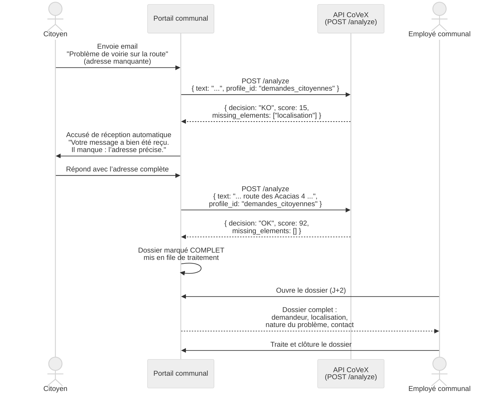
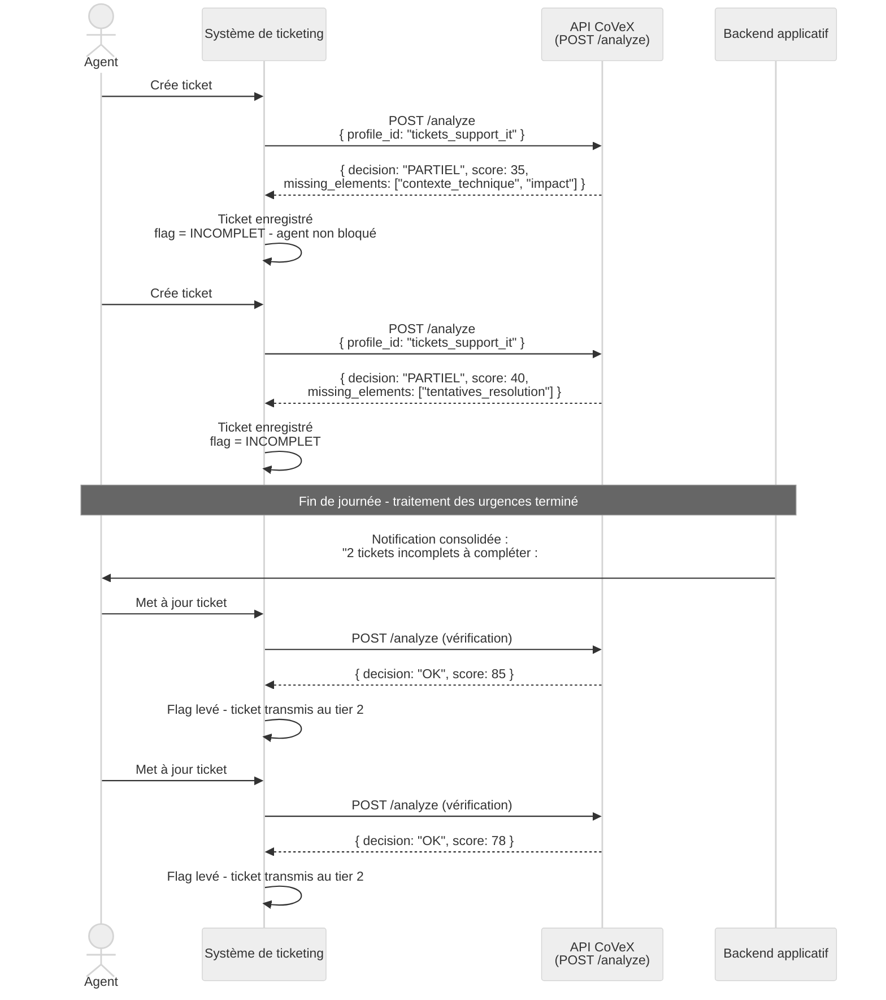
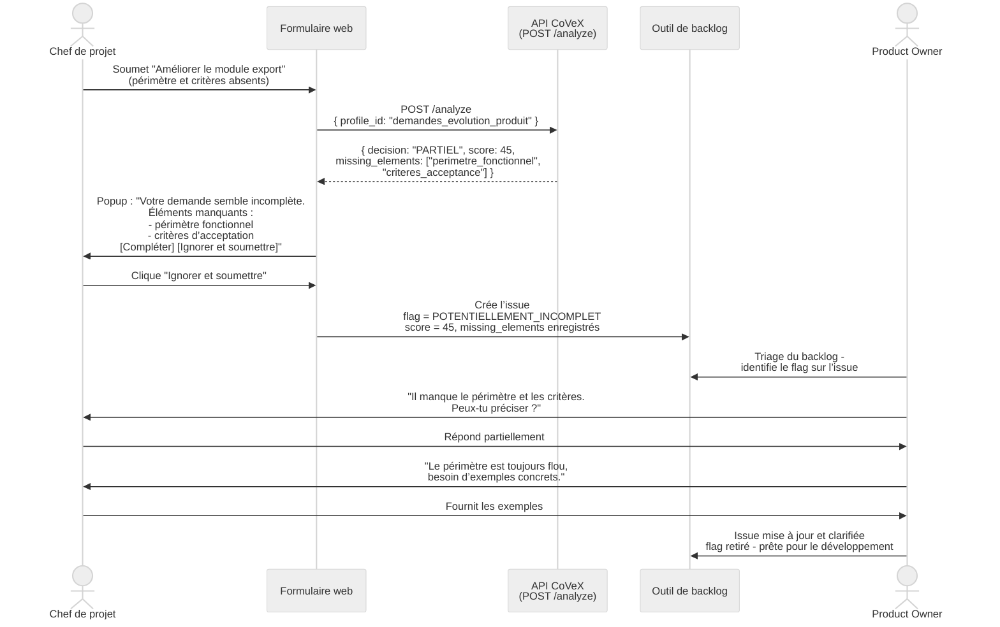
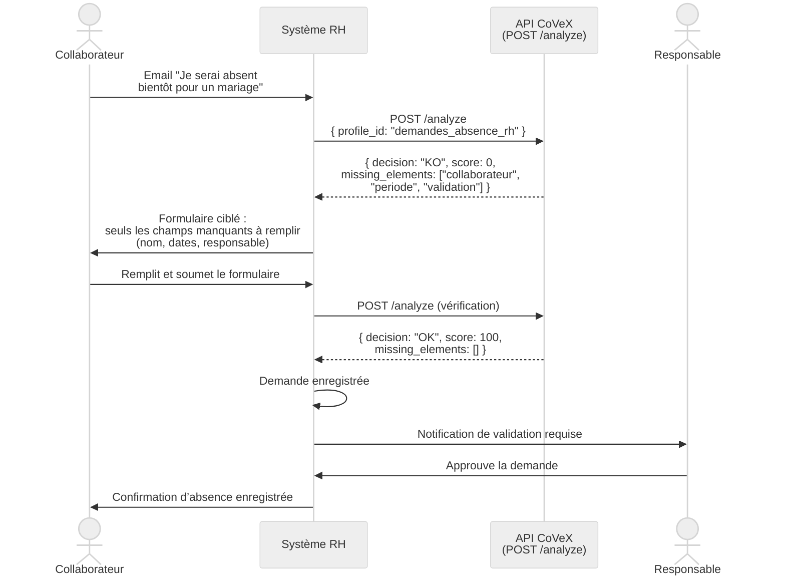
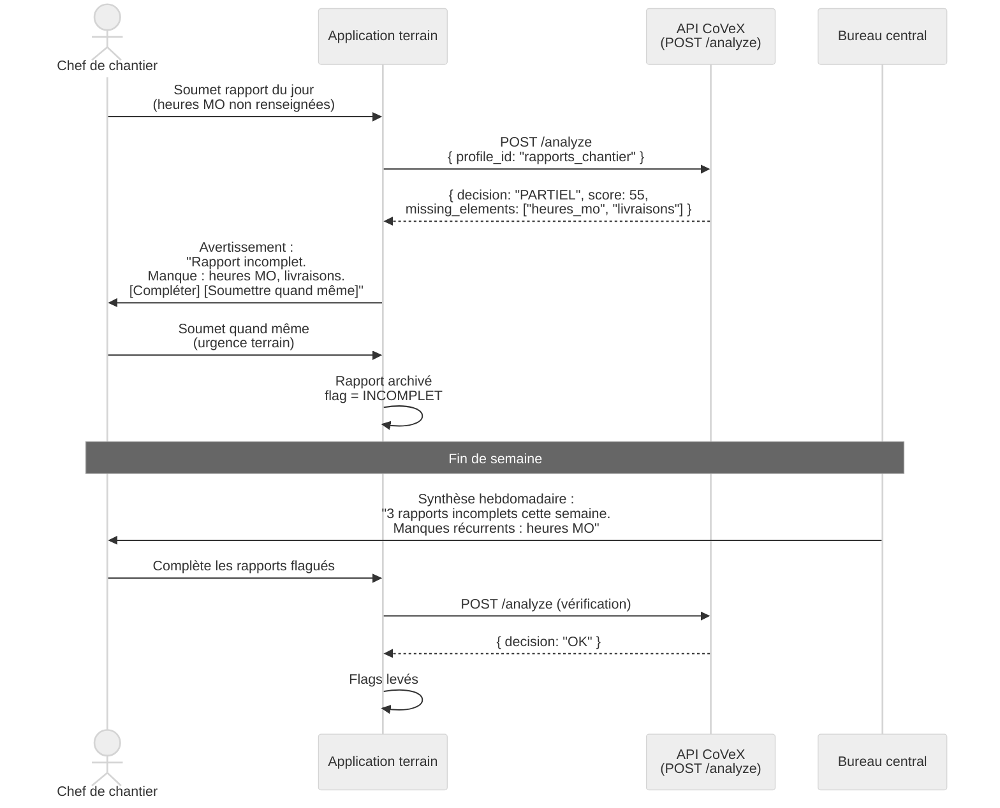

<!-- 

Instructions pour les LLM mettant à jour ce fichier :

1. **Identifiants de section** :
   - Chaque section doit commencer par un identifiant unique en majuscules, composé de 3 lettres parlantes (ex: GLO pour Glossaire, EXA pour Exemples d’analyse).
   - Cet identifiant doit être cohérent avec ceux déjà présents dans le fichier.
   - Exemple : `# GLO: Glossaire des termes techniques`.

2. **Structure et mise en forme** :
   - Utiliser des titres clairs et hiérarchisés (`##`, `###`).
   - Privilégier les listes, tableaux ou blocs de code pour une meilleure lisibilité.
   - Conserver les séparateurs (`---`) entre les sections pour une meilleure organisation visuelle.

3. **Contenu** :
   - Rester concis et précis. Éviter les répétitions.
   - Adapter le ton au public cible (lecteurs techniques et non techniques).
   - Ne pas modifier ou supprimer les sections existantes sans justification explicite.

4. **Ajout de nouvelles sections** :
   - Vérifier que le sujet n’est pas déjà couvert dans une autre section.
   - Respecter un ordre logique des sections (contexte, méthode, usage, évaluation, référence).
   - Ajouter une entrée dans la table des matières si elle existe.

5. **Mises à jour** :
   - Si une section est modifiée, vérifier que les références à cette section dans le reste du document (ou dans `CoVeX-1-rapport.md`) restent valides.
   - Documenter les changements majeurs en commentaire ou dans une section dédiée.

6. **Règles spécifiques** :
   - Ne pas utiliser d’accents dans les identifiants, titres techniques ou noms de fichiers.
   - Conserver les liens vers les annexes ou références externes si présents.
   - Ne pas ajouter de contenu promotionnel ou non pertinent.

-->

## Table des matières

- [IAG : IA générative](#annexe-iag)
- [BMD : Méthode BMad](#annexe-bmd)
- [INS : Installation et validation](#annexe-ins)
- [SCN : Scénarios d’usage](#annexe-scn)
- [GDS : Golden dataset](#annexe-gds)
- [MOT : Sélection des moteurs](#annexe-mot)
- [LOC : Modèles locaux](#annexe-loc)
- [EXA : Exemples d’analyse](#annexe-exa)
- [SOL : Solutions proches](#annexe-sol)
- [GLO : Glossaire](#annexe-glo)

<a id="annexe-iag"></a>
# IAG: IA générative

L’IA générative a joué un rôle concret et documentable dans la réalisation de ce projet, un apport qu’il convient d’évaluer avec lucidité. Il est important de préciser que les lignes qui suivent se concentrent exclusivement sur l’IA en tant qu’outil d’assistance (brainstorming, analyse, cadrage, rédaction), et non comme composant technique du prototype CoVeX.

Dans la **phase de cadrage**, l’IA a accéléré l’exploration des problématiques liées à la complétude, des approches existantes et des architectures candidates. Elle a permis de confronter rapidement les concepts pertinents, tels que le few-shot prompting, l’extraction structurée ou la configuration par profils. Le gain n’est pas seulement temporel, mais intellectuel : l’IA a ouvert des pistes que l’auteur n’aurait pas nécessairement envisagées seul.

Dans la **phase de conception**, elle a activement contribué à l’élaboration des profils métier. Les critères de complétude, les poids et les exemples de few-shot ont été construits par itération à partir d’hypothèses initiales lors des interviews de brainstorming (méthode BMad), puis enrichis grâce à des formulations alternatives, des cas limites et des nuances de rédaction. La qualité du golden dataset en témoigne : les cas ont été affinés pour couvrir des situations représentatives offrant des niveaux de complétude contrastés.

Dans la **phase de rédaction**, l’outil a aidé à structurer les documents, à clarifier l’argumentation et à reformuler les passages ambigus, sans jamais se substituer à la réflexion de fond ni inventer de contenu non justifié par les sources.

Il importe cependant de distinguer ce que l’IA apporte de ce qu’elle ne fait pas. Les choix d’architecture, les arbitrages techniques, les implémentations et les tests relèvent strictement d’un travail humain directeur. Le bénéfice principal réside dans une accélération intellectuelle - mieux penser, mieux structurer, mieux formuler - plutôt que dans une simple accélération de production. Si l’IA clarifie, propose et reformule, les décisions finales reviennent toujours à l’auteur. Cette distinction entre stimulation intellectuelle et automatisation pure est essentielle pour évaluer honnêtement l’apport réel de ces outils.

---

<a id="annexe-bmd"></a>
# BMD: Méthode BMad

## Présentation de BMad

BMad (Build More Architect Dreams, désigné aussi Breakthrough Method for Agile AI-driven Development) est un framework de développement logiciel piloté par IA. Il fournit des agents spécialisés, des workflows guidés et une planification structurée qui s’adapte à la complexité du projet. BMad organise le cycle de vie d’un projet logiciel en quatre phases :
- **Analyse** (brainstorming, recherche, product brief)
- **Planning** (formalisation des exigences via un PRD - Product Requirements Document)
- **Solutioning** (architecture technique, design UX, décomposition en epics et stories)
- **Implémentation** (développement story par story avec revue de code intégrée)

Chaque phase de la méthode BMad fait intervenir des agents IA spécialisés. Ces agents ne sont pas des logiciels autonomes, mais des configurations de prompt (personas, instructions, connaissances contextuelles) activées au sein d’environnements de développement ou d’éditeurs de code (comme OpenCode ou Cursor AI). De plus, cette approche est totalement agnostique au modèle, ce qui permet de l’exécuter avec n’importe quel modèle de langage.

Les principaux agents de BMad sont :

| Agent        | Rôle                                                              |
|--------------|-------------------------------------------------------------------|
| **Analyst**  | Brainstorming, recherche exploratoire                             |
| **PM**       | Rédaction du PRD, création des epics et stories                   |
| **Architect**| Conception de l’architecture, vérification de cohérence           |
| **UX Designer** | Spécification UX et design des interfaces                     |
| **SM** (Scrum Master) | Planification de sprint, suivi, rétrospective            |
| **DEV**      | Implémentation des stories, revue de code                         |

Les agents communiquent via des artefacts versionnés (Markdown, YAML) stockés dans `_bmad-output/`. Chaque workflow produit ou consomme des artefacts spécifiques, créant une chaîne de traçabilité entre le cadrage initial et l’implémentation finale.

<!-- VISUEL-TODO
id:      a-bmad-cycle-phases
label:   Cycle de vie BMad applique au projet CoVeX
type:    infographique NotebookLM
source:  Annexe La methode BMad, section Presentation et section Workflows utilises (lignes 349-393)
prompt:  Génère un infographique représentant le cycle de vie de la méthode BMad appliqué au projet CoVeX, en incluant les phases successives (Analyse, Planning, Solutioning, Implementation), les agents impliqués, les artefacts produits et la boucle de retour. Base-toi sur les informations du rapport.md et de son annexe.md.
-->

## Workflows utilisés dans le projet

Les workflows BMad effectivement utilisés dans le projet CoVeX sont les suivants, avec les artefacts produits :

### Phase 1 - Analyse

- **`create-product-brief`** : production du product brief initial, document de cadrage décrivant la vision, la problématique, les personas et les contraintes du projet.

### Phase 2 - Planning

- **`create-prd`** : rédaction du PRD complet (823 lignes), formalisant les exigences fonctionnelles, non fonctionnelles, les parcours utilisateurs et les critères de succès.
- **`prd-validation`** : trois rapports de validation du PRD produits (2026-02-02, 2026-02-05 et rapport initial), vérifiant la cohérence et la complétude des exigences.

### Phase 3 - Solutioning

- **`create-architecture`** : conception de l’architecture technique (698 lignes), documentant les choix technologiques, les patterns de design et les décisions d’infrastructure.
- **`create-ux-design`** : spécification UX du playground (HTML de prévisualisation et spécification Markdown).
- **`create-epics-and-stories`** : décomposition en 4 epics et 15+ stories avec critères d’acceptation détaillés.
- **`check-implementation-readiness`** : rapport de vérification de cohérence entre PRD, architecture et stories avant implémentation.

### Phase 4 - Implémentation

- **`sprint-planning`** : création du fichier `sprint-status.yaml` traçant l’état de chaque epic et story.
- **`create-story`** : production de fichiers story détaillés pour chaque user story (15 fichiers dans `implementation-artifacts/`).
- **`dev-story`** : implémentation story par story par l’agent DEV.
- **`code-review`** : revue de code automatisée après implémentation.
- **`correct-course`** : deux propositions de changement de direction (2026-02-23 et 2026-03-07), documentant respectivement la simplification du code et le retrait du routage automatique.

## Artefacts produits

L’ensemble des artefacts BMad est versionné dans le dépôt sous `_bmad-output/` et accessible directement :

**Artefacts de planification** (`_bmad-output/planning-artifacts/`) :

| Artefact | Lien GitHub | Description |
|----------|-------------|-------------|
| Product Brief | [product-brief-CoVeX.md](https://github.com/jburdy/CoVeX/blob/main/_bmad-output/planning-artifacts/product-brief-CoVeX.md) | Vision, problématique, personas, contraintes |
| PRD | [prd.md](https://github.com/jburdy/CoVeX/blob/main/_bmad-output/planning-artifacts/prd.md) | Exigences fonctionnelles et non fonctionnelles |
| Architecture | [architecture.md](https://github.com/jburdy/CoVeX/blob/main/_bmad-output/planning-artifacts/architecture.md) | Choix techniques, patterns, infrastructure |
| Epics | [epics.md](https://github.com/jburdy/CoVeX/blob/main/_bmad-output/planning-artifacts/epics.md) | Décomposition en epics et stories |
| UX Specification | [ux-design-specification.md](https://github.com/jburdy/CoVeX/blob/main/_bmad-output/planning-artifacts/ux-design-specification.md) | Spécification UX du playground |
| UX Preview | [ux-design-directions.html](https://github.com/jburdy/CoVeX/blob/main/_bmad-output/planning-artifacts/ux-design-directions.html) | Maquette HTML de prévisualisation |
| Rapports de validation PRD | [prd-validation-report.md](https://github.com/jburdy/CoVeX/blob/main/_bmad-output/planning-artifacts/prd-validation-report.md) | Vérification de cohérence du PRD |
| Readiness Report | [implementation-readiness-report-2026-02-12.md](https://github.com/jburdy/CoVeX/blob/main/_bmad-output/planning-artifacts/implementation-readiness-report-2026-02-12.md) | Validation pré-implémentation |
| Change Proposal (simplification) | [sprint-change-proposal-2026-02-23.md](https://github.com/jburdy/CoVeX/blob/main/_bmad-output/planning-artifacts/sprint-change-proposal-2026-02-23.md) | Simplification du code avant défense |
| Change Proposal (routage) | [sprint-change-proposal-2026-03-07.md](https://github.com/jburdy/CoVeX/blob/main/_bmad-output/planning-artifacts/sprint-change-proposal-2026-03-07.md) | Retrait du routage automatique |
| Scénarios de test | [covex-test-scenarios.yaml](https://github.com/jburdy/CoVeX/blob/main/_bmad-output/planning-artifacts/covex-test-scenarios.yaml) | Cas de test initiaux |
| Plan de migration LangExtract | [langextract-migration-cleanup-plan.md](https://github.com/jburdy/CoVeX/blob/main/_bmad-output/planning-artifacts/langextract-migration-cleanup-plan.md) | Plan de migration vers LangExtract |

**Artefacts d’implémentation** (`_bmad-output/implementation-artifacts/`) :

| Artefact | Lien GitHub | Description |
|----------|-------------|-------------|
| Sprint status | [sprint-status.yaml](https://github.com/jburdy/CoVeX/blob/main/_bmad-output/implementation-artifacts/sprint-status.yaml) | État de chaque epic et story |
| Story 1-1 | [1-1-set-up-initial-project-from-starter-template.md](https://github.com/jburdy/CoVeX/blob/main/_bmad-output/implementation-artifacts/1-1-set-up-initial-project-from-starter-template.md) | Setup initial du projet |
| Story 1-2 | [1-2-implementer-le-moteur-de-scoring-et-de-decision.md](https://github.com/jburdy/CoVeX/blob/main/_bmad-output/implementation-artifacts/1-2-implementer-le-moteur-de-scoring-et-de-decision.md) | Moteur de scoring |
| Story 2-1 | [2-1-charger-et-valider-la-configuration-des-modeles.md](https://github.com/jburdy/CoVeX/blob/main/_bmad-output/implementation-artifacts/2-1-charger-et-valider-la-configuration-des-modeles.md) | Configuration des modèles |
| Story 2-5 | [2-5-supporter-un-provider-d-inference-distant-configurable.md](https://github.com/jburdy/CoVeX/blob/main/_bmad-output/implementation-artifacts/2-5-supporter-un-provider-d-inference-distant-configurable.md) | Provider distant |
| Story 3-1 | [3-1-construire-le-playground-de-saisie-et-lancement-d-analyse.md](https://github.com/jburdy/CoVeX/blob/main/_bmad-output/implementation-artifacts/3-1-construire-le-playground-de-saisie-et-lancement-d-analyse.md) | Playground |
| ... | - | 15 stories au total, toutes versionnées |

## Gain de qualité apporté par BMad

L’apport principal de BMad dans le projet CoVeX se situe dans les phases d’analyse, de planification et de spécification. La méthode a produit des artefacts structurés - product brief, PRD, architecture, epics - qui ont imposé une discipline de cadrage rarement atteinte dans un projet individuel. Le PRD de 823 lignes documente exhaustivement les exigences fonctionnelles et non fonctionnelles, les parcours utilisateurs et les critères de succès. Le document d’architecture de 698 lignes explicite chaque choix technique. Ces artefacts ont servi de référence stable pendant toute la phase d’implémentation.

Le gain de qualité est intellectuel plus que productif. BMad n’accélère pas la production de code, mais il force une réflexion approfondie sur les exigences, les contraintes et les arbitrages avant de coder. Pour un projet de CAS réalisé en grande partie avec des agents de code, cette discipline de spécification est particulièrement précieuse : elle fournit aux agents un cadre explicite qui réduit les ambiguïtés et limite les dérives d’implémentation.

Les rapports de validation du PRD et le rapport de readiness illustrent cette rigueur : ils identifient les incohérences, les exigences sous-spécifiées et les risques techniques avant que la première ligne de code ne soit écrite. Les deux change proposals documentent formellement les pivots stratégiques - simplification du code et retrait du routage automatique - avec analyse d’impact sur les epics et les stories.

## Évaluation nuancée : valeur et limites

### Valeur pour l’analyse et le cadrage

La valeur de BMad est incontestable pour les phases amont. Le cycle analyse-planning-solutioning a produit des documents de cadrage d’une qualité et d’une complétude difficilement atteignables sans le guidage structuré de la méthode. Les workflows de validation croisée (PRD validation, implementation readiness) ont identifié des incohérences qui auraient autrement émergé tard dans l’implémentation.

### Lourdeur des workflows d’implémentation

En revanche, les workflows BMad d’implémentation (create-story, dev-story, code-review, sprint-status) se sont révélés disproportionnés pour un prototype de CAS. La décomposition en 15+ stories avec critères d’acceptation détaillés, fichiers story individuels et workflow de revue de code est adaptée à un produit industriel avec une équipe, mais elle introduit une surcharge procédurale significative pour un projet individuel soumis à des ajustements expérimentaux rapides.

Le suivi par `sprint-status.yaml`, les rétrospectives formelles et le processus create-story/dev-story/code-review imposent un overhead qui, dans le contexte d’un prototype exploratoire, ralentit la boucle d’itération sans apporter une valeur proportionnelle. L’auteur a fréquemment contourné ces workflows en procédant à des modifications directes, puis en mettant à jour le sprint status a posteriori.


### Effet d’inertie des spécifications BMad

Un phénomène inattendu a été observé lors des phases de refactoring : les artefacts BMad (PRD, architecture, stories) ont continué à influencer les décisions d’implémentation même lorsque l’intention explicite était de s’en écarter. Les agents de code, en lisant le contexte du projet, se conformaient aux spécifications résiduelles contenues dans `_bmad-output/`, reproduisant des patterns ou des structures que l’auteur souhaitait abandonner.

Cet effet d’inertie constitue une forme de **dette de spécification** : les artefacts de cadrage, initialement utiles, deviennent un frein lorsque le projet pivote. Le routage automatique des profils illustre bien ce phénomène. Retiré de l’intention de l’auteur après réflexion, il restait spécifié dans le PRD (exigences FR3, FR16-FR18), l’architecture et la story 1-3. Les agents de code, consultés pour des refactorings ultérieurs, proposaient régulièrement des implémentations cohérentes avec ces spécifications obsolètes.

La leçon pratique est double. Premièrement, dans un projet assisté par IA, les artefacts de spécification ne sont pas de simples documents de référence humaine : ils constituent un contexte actif qui influence les décisions des agents. Deuxièmement, la gouvernance de ces artefacts - mise à jour, archivage ou annotation explicite des sections obsolètes - est un enjeu concret de gestion de projet assisté par IA, pas une simple question de documentation.

Le change proposal `sprint-change-proposal-2026-03-07.md` documente formellement ce pivot et son impact sur les artefacts, illustrant la nécessité d’un processus de correction de trajectoire même (et surtout) dans un projet piloté par des spécifications structurées.

---


<a id="annexe-ins"></a>
# INS: Installation et validation

## Prérequis

- **Python** >= 3.14
- **uv** (gestionnaire de packages et runner Python) : https://docs.astral.sh/uv/
- **Git** pour cloner le dépôt
- Une clé API pour au moins un fournisseur distant (Groq, OpenRouter ou Google) ou un serveur Ollama local

## Obtenir le code source

Le code source est livré sur GitHub :

```bash
git clone https://github.com/jburdy/CoVeX.git
cd CoVeX
```

## Structure du projet

```text
CoVeX/
├── backend/
│   ├── src/
│   │   ├── main.py
│   │   ├── settings.py
│   │   ├── analysis.py
│   │   ├── analysis_profiles_config.py
│   │   └── inference.py
│   └── tests/
├── playground/
│   └── src/
│       ├── app.py
│       ├── api_client.py
│       └── playground.py
├── config/
│   ├── analysis_profiles.yaml
│   └── inference_engines.yaml
├── datasets/
│   └── golden_dataset.jsonl
├── docs/
│   ├── ARCHITECTURE.md
│   └── ANALYSIS_PROFILES_METIER.md
├── tools/
│   ├── validation/
│   │   ├── api_smoke.py
│   │   └── backend_runner.py
│   ├── evaluation/
│   │   ├── engine_case_store.py
│   │   ├── evaluation_models.py
│   │   └── run_dataset_evaluation.py
│   └── research/
│       ├── engine_candidates.txt
│       ├── render_engine_selection_report.py
│       ├── select_engines_by_cost.md
│       └── select_engines_by_cost.py
├── artifacts/
│   └── evaluation/
├── sAPI_kill.sh
├── sAPI_start.sh
├── sPlayGround_start.sh
└── README.md
```

Le répertoire `backend/` contient l’API FastAPI, cœur du prototype. Le répertoire `playground/` contient l’interface NiceGUI de démonstration. Le répertoire `config/` centralise la configuration des profils d’analyse et des moteurs d’inférence. Le répertoire `tools/` regroupe les scripts de validation, d’évaluation et de recherche.

## Installation et lancement

**Initialisation :**

```bash
cp .env.example .env
# Renseigner au minimum COVEX_GROQ_API_KEY dans .env
uv sync --all-groups --project backend
uv sync --all-groups --project playground
```

**Lancement de l’API (depuis la racine) :**

```bash
uv run --project backend uvicorn main:app --app-dir backend/src --reload
```

L’API est accessible sur `http://127.0.0.1:8000`. Le point d’entrée principal est `POST /analyze`.

**Lancement du playground (depuis la racine) :**

```bash
uv run --project playground python playground/src/app.py
```

Le playground est accessible sur `http://127.0.0.1:8080`.

## CoVeX est avant tout une API

Le point d’usage principal de CoVeX est l’endpoint `POST /analyze`. Le playground n’est qu’un outil de démonstration et de validation. En production, CoVeX est appelé par un ERP, un formulaire, un système de ticketing ou tout autre système métier via HTTP.

**Exemple d’appel API :**

```bash
curl -X POST http://127.0.0.1:8000/analyze \
  -H "Content-Type: application/json" \
  -d '{"text": "ça marche pas", "profile_id": "tickets_support_it"}'
```

La réponse contient `score`, `decision`, `justification`, `covered_elements`, `missing_elements`, `extractions`, `latency_sec` et `model_used`.

## Validation rapide

```bash
# Tests backend
cd backend && uv run ruff check src tests && uv run pytest

# Smoke test HTTP
uv run --project backend python tools/validation/api_smoke.py

# Évaluation sur le golden dataset
uv run --project backend python tools/evaluation/run_dataset_evaluation.py --limit 3
```

---

<a id="annexe-scn"></a>
# SCN: Scénarios d’usage

Cette annexe illustre le comportement de CoVeX dans des scénarios réels à travers des diagrammes de séquence UML. Chaque cas met en scène les acteurs impliqués et montre la chronologie des échanges - y compris les appels à l’API `POST /analyze` - depuis la soumission initiale jusqu’à la clôture du dossier. Les participants sont les acteurs humains (citoyen, agent, chef de projet), les systèmes métier appelants (portail, système de ticketing, ERP), l’API CoVeX et le backend applicatif.

## SCN-1 - Demande citoyenne incomplète puis traitée en différé

**Scénario :** Un citoyen envoie un email à sa commune pour signaler un problème de voirie. L’email manque d’adresse précise. CoVeX détecte le manque en moins d’une seconde et le portail communal envoie automatiquement un accusé de réception ciblé. Deux jours plus tard, le citoyen répond avec l’adresse manquante ; l’employé communal ouvre alors le dossier complet et peut le traiter directement, sans aller-retour.



**Enseignements :** CoVeX intervient deux fois dans ce flux : une première analyse instantanée (~2,9 s, moteur `cost_score` 3) déclenche l’accusé de réception ciblé ; une seconde analyse lors de la réponse du citoyen valide la complétude. L’employé communal ne reçoit dans sa file que des dossiers complets, éliminant les allers-retours habituellement nécessaires pour obtenir une adresse. La latence reste imperceptible dans ce contexte asynchrone (email).

---

## SCN-2 - Agent de support : compte-rendu incomplet et notification en fin de journée

**Scénario :** Un agent de support IT crée rapidement plusieurs tickets lors d’une période chargée, sans renseigner tous les éléments requis. CoVeX signale les lacunes sans bloquer l’agent. En fin de journée, le backend envoie une notification consolidée listant les tickets à compléter. L’agent les traite dans un moment dédié.



**Enseignements :** Bloquer l’agent en temps réel pendant les urgences serait contre-productif et génèrerait du contournement. La valeur réside dans la collecte différée : le backend agrège les flags et produit une liste d’actions ciblée en fin de journée. L’agent complète les informations dans un moment dédié, avec le recul nécessaire. Ce pattern "batch de rattrapage" est adapté aux organisations où la saisie rapide prime en temps réel.

---

## SCN-3 - Chef de projet : demande vague, popup ignoré, issue flagguée

**Scénario :** Un chef de projet soumet une demande d’évolution produit trop vague depuis un formulaire web. Un popup l’informe des éléments manquants. Il choisit de l’ignorer et soumet quand même. L’issue est enregistrée avec un flag de complétude insuffisante, ce qui génère des allers-retours ultérieurs avec le product owner.



**Enseignements :** Ce cas documente la limite du modèle non bloquant : si l’utilisateur ignore le signal, la dette informationnelle est simplement différée. Le flag rend ce coût visible dans le backlog - le product owner peut prioriser les issues complètes et identifier les demandeurs systématiquement insuffisants. Les métadonnées `score` et `missing_elements` permettent également une analyse rétrospective des patterns de saisie par profil ou par utilisateur.

---

## SCN-4 - Responsable RH : demande d’absence par email, formulaire ciblé en retour

**Scénario :** Un collaborateur envoie une demande d’absence par email sans préciser ses dates ni son responsable. Le système RH intègre CoVeX et renvoie un formulaire pré-rempli ne portant que les champs manquants. Le collaborateur le complète ; le responsable reçoit la notification de validation.



**Enseignements :** L’email libre est le mode de saisie naturel pour beaucoup de collaborateurs ; CoVeX extrait les manques et permet au système RH de renvoyer un formulaire ciblé sur les seuls éléments absents, plutôt qu’un formulaire complet à remplir de zéro. Le collaborateur n’est pas confronté à un rejet brutal mais à une aide à la complétion. Ce pattern est particulièrement adapté aux processus RH où la résistance aux formulaires structurés est élevée.

---

## SCN-5 - Rapport de chantier : soumission terrain et synthèse hebdomadaire

**Scénario :** Un chef de chantier soumet son rapport quotidien depuis une tablette. Certains jours, des éléments manquent (heures de main-d’œuvre, livraisons). CoVeX signale les lacunes sans bloquer la soumission. Le bureau central reçoit une synthèse hebdomadaire des rapports flagués pour relance ciblée.



**Enseignements :** Ce cas montre que la granularité temporelle de la validation peut être adaptée au rythme métier. Un chantier ne peut pas s’arrêter parce qu’un champ de rapport est manquant. La synthèse hebdomadaire des flags est un compromis raisonnable : elle préserve la fluidité opérationnelle sur le terrain tout en maintenant une pression qualité sur la durée. Les manques récurrents identifiés dans la synthèse peuvent également alimenter une démarche d’amélioration des pratiques de saisie.

---

## Synthèse comparative des cas d’usage

| Cas | Profil | Décision type | Réaction CoVeX | Pattern temporel | Risque principal |
|-----|--------|:-------------:|----------------|:----------------:|-----------------|
| SCN-1 Citoyen | `demandes_citoyennes` | KO → OK | Accusé ciblé + re-analyse | Différé (email, J+2) | Abandon si relance perçue comme complexe |
| SCN-2 Support | `tickets_support_it` | PARTIEL | Flag + notification fin de journée | Batch quotidien | Accumulation si agent chroniquement débordé |
| SCN-3 Chef de projet | `demandes_evolution_produit` | PARTIEL | Popup ignorable + flag backlog | Temps réel + différé | Allers-retours coûteux si popup systématiquement ignoré |
| SCN-4 RH | `demandes_absence_rh` | KO | Formulaire ciblé pré-rempli | Synchrone (email → formulaire) | Friction si formulaire perçu comme une contrainte supplémentaire |
| SCN-5 Chantier | `rapports_chantier` | PARTIEL | Avertissement tablette + synthèse hebdo | Hybride terrain / bureau | Complétions a posteriori peu fiables si délai trop long |

Ces cas illustrent le spectre des modes d’intégration de CoVeX : signalement synchrone, notification consolidée, popup ignorable, formulaire ciblé. Dans tous les cas, CoVeX ne décide pas à la place du système appelant - il fournit un signal structuré (`score`, `decision`, `missing_elements`) que l’application intégrante transforme en action adaptée au contexte métier et à la tolérance au blocage de chaque organisation.

---

<a id="annexe-gds"></a>
# GDS: Golden dataset

## Structure et rôle

Le golden dataset (`datasets/golden_dataset.jsonl`) est un corpus de référence de cinquante cas couvrant les onze profils métier de CoVeX. Chaque entrée est un objet JSON avec les champs suivants :

| Champ               | Type     | Description                                         |
|----------------------|----------|-----------------------------------------------------|
| `id`                | string   | Identifiant unique du cas (ex. `TC-IT-001`)         |
| `profile_id`        | string   | Profil d’analyse applicable                         |
| `text`              | string   | Texte de saisie à analyser                          |
| `decision_expected` | string   | Décision attendue : `OK`, `PARTIEL` ou `KO`         |
| `tags`              | string[] | Tags d’usage (ex. `playground` pour les exemples UI) |

## Répartition par profil

| Profil                         | Nombre de cas | OK | PARTIEL | KO |
|--------------------------------|:-------------:|:--:|:-------:|:--:|
| `demandes_citoyennes`          | 14            | 5  | 4       | 5  |
| `demandes_evolution_produit`   | 9             | 3  | 3       | 3  |
| `demandes_achat`               | 9             | 2  | 2       | 5  |
| `tickets_support_it`           | 5             | 1  | 1       | 3  |
| `cr_intervention`              | 5             | 2  | 1       | 2  |
| `demandes_absence_rh`          | 5             | 2  | 2       | 1  |
| `suivi_scolaire`               | 5             | 3  | 1       | 1  |
| `demandes_devis_construction`  | 5             | 2  | 2       | 1  |
| `rapports_chantier`            | 4             | 1  | 2       | 1  |
| `validation_qualite`           | 4             | 2  | 1       | 1  |
| `suivi_projet`                 | 3             | 2  | 1       | 0  |

Les trois niveaux de décision sont représentés dans chaque profil lorsque le volume le permet. Les textes couvrent des registres de langue variés : du message informel minimal (*"ça marche pas"*) au document structuré complet avec références normées.

<!-- VISUEL-TODO
id:      a-golden-dataset-repartition
label:   Repartition des cas du golden dataset par profil et decision
type:    infographique NotebookLM
source:  Annexe Golden dataset, tableau de repartition par profil (lignes 111-123)
prompt:  Génère un infographique illustrant la répartition des 50 cas du golden dataset par profil et par décision (OK, PARTIEL, KO). Base-toi sur les informations du rapport.md et de son annexe.md.
-->

## Usages dans le projet

Le golden dataset remplit trois fonctions complémentaires :

1. **Évaluation empirique** : le script `tools/evaluation/run_dataset_evaluation.py` rejoue l’ensemble des cas contre l’API et mesure les concordances entre décisions obtenues et attendues.
2. **Exemples du playground** : les cas portant le tag `playground` alimentent la liste d’exemples de l’interface de démonstration, permettant de tester rapidement chaque profil.
3. **Benchmark de sélection des moteurs** : le script `tools/research/select_engines_by_cost.py` utilise un sous-ensemble de cinq cas par profil (sélection automatique) pour comparer systématiquement neuf moteurs d’inférence.

---

<a id="annexe-mot"></a>
# MOT: Sélection des moteurs

## Démarche

La sélection des moteurs d’inférence repose sur une évaluation outillée menée avec le script `tools/research/select_engines_by_cost.py`. Ce script teste systématiquement une liste de moteurs candidats (définis dans `tools/research/engine_candidates.txt`) sur chaque profil du golden dataset, puis identifie le moteur le moins coûteux atteignant 100 % de concordance avec les bandes de score attendues.

Le processus fonctionne en trois étapes :

1. **Évaluation** : pour chaque couple (profil, moteur), le script appelle `POST /analyze` sur cinq cas du golden dataset et compare la décision obtenue à la bande attendue (0-35 pour KO, 36-75 pour PARTIEL, 76-100 pour OK).
2. **Persistance** : chaque résultat est écrit dans `artifacts/evaluation/engine_selection_results.csv`, permettant la reprise et l’historique.
3. **Recommandation** : le moteur le moins cher (`cost_score` le plus bas) qui passe tous les cas d’un profil est recommandé. Si aucun moteur ne réussit, le moteur existant du profil est conservé.

## Rôle du `cost_score`

Le `cost_score` est un indice relatif défini dans `config/inference_engines.yaml` pour chaque moteur. Il abstrait le compromis performance/coût sans exposer les tarifs bruts des fournisseurs :

| `cost_score` | Exemples de moteurs                                  | Profil type           |
|:------------:|------------------------------------------------------|------------------------|
| 1            | `remote_groq_llama31_8b_instant`                     | 8 profils sur 11       |
| 2            | `remote_groq_gpt_oss_20b`                            | 2 profils              |
| 3            | `remote_openrouter_mistral_small_32_24b`             | 1 profil               |
| 5            | `remote_openrouter_llama33_70b`                      | -                      |
| 6-16         | Moteurs locaux (Ollama)                              | -                      |
| 28           | `remote_google_gemini25_flash`                       | -                      |

La liaison profil-moteur s’effectue via le champ `inference_engine_key` dans `config/analysis_profiles.yaml`. Chaque profil spécifie le moteur recommandé issu de la campagne de benchmark.

## Résultats synthétiques

Le rapport complet est disponible dans `artifacts/evaluation/engine_selection_report.md`. Les points saillants sont les suivants :

**Vue rapide par profil (extrait) :**

| Profil                        | Moteur recommandé                           | Concordance | Latence moy. | `cost_score` |
|-------------------------------|---------------------------------------------|:-----------:|:------------:|:------------:|
| `demandes_achat`              | `remote_groq_llama31_8b_instant`            | 5/5 (100 %) | 0,28 s       | 1            |
| `tickets_support_it`          | `remote_groq_llama31_8b_instant`            | 5/5 (100 %) | 0,29 s       | 1            |
| `suivi_scolaire`              | `remote_groq_llama31_8b_instant`            | 5/5 (100 %) | 0,34 s       | 1            |
| `cr_intervention`             | `remote_groq_llama31_8b_instant`            | 5/5 (100 %) | 0,35 s       | 1            |
| `demandes_devis_construction` | `remote_groq_llama31_8b_instant`            | 5/5 (100 %) | 0,37 s       | 1            |
| `suivi_projet`                | `remote_groq_llama31_8b_instant`            | 2/2 (100 %) | 0,38 s       | 1            |
| `validation_qualite`          | `remote_groq_llama31_8b_instant`            | 4/4 (100 %) | 0,42 s       | 1            |
| `rapports_chantier`           | `remote_groq_llama31_8b_instant`            | 4/4 (100 %) | 0,46 s       | 1            |
| `demandes_absence_rh`         | `remote_groq_gpt_oss_20b`                   | 5/5 (100 %) | 0,79 s       | 2            |
| `demandes_evolution_produit`  | `remote_groq_gpt_oss_20b`                   | 5/5 (100 %) | 0,92 s       | 2            |
| `demandes_citoyennes`         | `remote_openrouter_mistral_small_32_24b`    | 5/5 (100 %) | 2,92 s       | 3            |

<!-- VISUEL-TODO
id:      a-moteurs-cout-profil
label:   Strategie d’affectation des moteurs par profil et niveau de cout
type:    infographique NotebookLM
source:  Annexe Selection comparative des moteurs d’inference, tableau Vue rapide par profil (lignes 170-182)
prompt:  Génère un infographique illustrant la stratégie d’affectation des moteurs par profil et niveau de coût (cost_score). Montre comment les profils sont répartis selon les niveaux de coût et mentionne les moteurs associés. Base-toi sur les informations du rapport.md et de son annexe.md.
-->

**Vue par moteur (classement global) :**

| Moteur                                    | Profils qualifiés | Taux cumulé |
|-------------------------------------------|:-----------------:|:-----------:|
| `remote_openrouter_mistral_small_32_24b`  | 10/11             | 98 %        |
| `remote_openrouter_llama33_70b`           | 9/11              | 96 %        |
| `remote_groq_llama31_8b_instant`          | 8/11              | 92 %        |
| `local_gemma3`                            | 8/11              | 90 %        |
| `remote_google_gemini25_flash`            | 7/11              | 88 %        |
| `local_mistral_nemo`                      | 7/11              | 86 %        |
| `local_ministral`                         | 6/11              | 80 %        |
| `remote_groq_gpt_oss_20b`                | 5/11              | 82 %        |
| `local_phi4_mini`                         | 1/11              | 36 %        |

<!-- VISUEL-TODO
id:      a-moteurs-classement-global
label:   Classement des moteurs par nombre de profils qualifies
type:    infographique NotebookLM
source:  Annexe Selection comparative des moteurs d’inference, tableau Vue par moteur (lignes 186-196)
prompt:  Génère un infographique montrant le classement des moteurs par nombre de profils qualifiés et taux cumulé, en différenciant les modèles locaux et distants. Base-toi sur les informations du rapport.md et de son annexe.md.
-->

## Enseignements

Le modèle le plus performant globalement (`remote_openrouter_mistral_small_32_24b`, 10/11 profils) n’est pas le plus économique. La stratégie retenue - affecter à chaque profil le moteur le moins cher qui atteint 100 % - permet d’utiliser le moteur `cost_score` 1 pour 8 profils sur 11, le `cost_score` 2 pour 2 profils, et le `cost_score` 3 uniquement pour le profil le plus exigeant. Le modèle local le plus petit (`local_phi4_mini`, 3,8B paramètres) échoue sur la quasi-totalité des profils, principalement en raison d’erreurs de parsing JSON, confirmant qu’un seuil minimal de capacité est nécessaire pour l’extraction structurée.

---

<a id="annexe-loc"></a>
# LOC: Modèles locaux

## Contexte

Le projet CoVeX a évalué plusieurs modèles locaux (SLM) via Ollama en complément des moteurs distants. Cette évaluation n’est pas le cœur du prototype mais constitue une exploration informative, documentée ici à titre de référence.

## Résultats observés

Les moteurs locaux testés dans la campagne de benchmark sont les suivants :

| Moteur local       | Modèle              | Profils qualifiés (100 %) | `cost_score` | Latence moy. |
|--------------------|----------------------|:-------------------------:|:------------:|:------------:|
| `local_gemma3`     | gemma3:4b            | 8/11                      | 7            | 8-16 s       |
| `local_mistral_nemo` | Mistral Nemo       | 7/11                      | 16           | 10-23 s      |
| `local_ministral`  | ministral-3:8b       | 6/11                      | 12           | 10-31 s      |
| `local_phi4_mini`  | phi4-mini:3.8b       | 1/11                      | 6            | 3-75 s       |

Les latences des moteurs locaux (typiquement 8 à 25 secondes par analyse, sur un poste de développement) sont incompatibles avec un usage en temps réel derrière un formulaire, mais acceptables pour un traitement batch ou un usage interne où la souveraineté des données prime sur la réactivité.

Le modèle `local_phi4_mini` (3,8 milliards de paramètres) échoue massivement : erreurs de parsing JSON sur la majorité des profils, timeouts fréquents, et un seul profil qualifié sur onze. Ce résultat confirme qu’un seuil minimal de capacité est nécessaire pour produire des extractions structurées fiables.

Le modèle `local_gemma3` (4 milliards de paramètres) obtient un résultat remarquable avec 8 profils qualifiés, démontrant que des SLM compacts peuvent être viables pour des tâches d’extraction structurée lorsque les exemples few-shot sont de bonne qualité. Sa limitation principale est la latence, qui le rend inadapté à un usage synchrone en temps réel.

## Implications pour la souveraineté

L’option locale reste pertinente pour des déploiements où la confidentialité des données est prioritaire. Les données ne quittent pas l’infrastructure de l’entreprise, éliminant les risques liés aux fournisseurs cloud. Le compromis latence/souveraineté est explicite et documenté, permettant à chaque organisation de choisir en connaissance de cause.

---

<a id="annexe-exa"></a>
# EXA: Exemples d’analyse

Cette annexe présente des exemples représentatifs de saisies soumises à l’API `POST /analyze`, accompagnées de la décision, du score, de la justification, des éléments couverts et manquants, ainsi que de la latence réelle mesurée. Les valeurs de `latency_sec` sont extraites du fichier d’évaluation `artifacts/evaluation/engine_case_results.jsonl` et reflètent les temps de réponse observés lors des campagnes de benchmark.

## Cas 1 - Ticket support IT, saisie minimale (KO)

- **Profil :** `tickets_support_it`
- **Texte soumis :** *"ça marche pas"*
- **Décision attendue :** KO
- **Décision obtenue :** KO
- **Score :** 0/100
- **Éléments couverts :** aucun
- **Éléments manquants :** symptôme, contexte technique, impact, tentatives de résolution, urgence
- **Latence :** 0,29 s (moteur `remote_groq_llama31_8b_instant`, `cost_score` 1)

Ce cas illustre une saisie typique "lazy writing" : aucune information exploitable n’est présente. Le score nul et la décision KO signalent au système appelant que la saisie est inutilisable en l’état.

## Cas 2 - Demande d’achat, saisie partielle (PARTIEL)

- **Profil :** `demandes_achat`
- **Texte soumis :** *"Bonjour, j’aurais besoin de deux casques audio Jabra Evolve2 40 pour l’équipe support avant la prochaine permanence. Le budget n’est pas encore validé mais l’usage est confirmé par le manager."*
- **Décision attendue :** PARTIEL
- **Décision obtenue :** PARTIEL
- **Score :** 40/100
- **Éléments couverts :** `article`, `justification`, `delai_urgence`
- **Éléments manquants :** `quantite_explicite`, `ref_financiere`
- **Latence :** 0,28 s (moteur `remote_groq_llama31_8b_instant`, `cost_score` 1)

L’article et le contexte d’usage sont identifiés, mais la quantité n’est pas formalisée de manière normée et la référence budgétaire manque. Le diagnostic PARTIEL permet au système appelant d’inviter l’utilisateur à compléter sa demande.

## Cas 3 - Compte-rendu d’intervention, saisie complète (OK)

- **Profil :** `cr_intervention`
- **Texte soumis :** *"Client : Baud & Fils SA - Site Yverdon-les-Bains (Réf. CLI-2847). Date : 31/01/2026, 09h00-11h30. Objet : Maintenance préventive annuelle climatisation hall production. [...] Intervention validée par M. Germanier (resp. maintenance site)."*
- **Décision attendue :** OK
- **Décision obtenue :** OK
- **Score :** 100/100
- **Éléments couverts :** `site`, `objet_constat`, `actions_realisees`, `tracabilite`
- **Éléments manquants :** aucun
- **Latence :** 0,34 s (moteur `remote_groq_llama31_8b_instant`, `cost_score` 1)

La saisie couvre l’intégralité des critères du profil. Le modèle extrait correctement le site, l’objet du constat, les actions réalisées et les éléments de traçabilité.

## Cas 4 - Demande citoyenne, saisie complète et formelle (OK)

- **Profil :** `demandes_citoyennes`
- **Texte soumis :** *"Objet : Annonce d’arrivée dans la commune [...] Jean ROCHAT"*
- **Décision attendue :** OK
- **Décision obtenue :** OK
- **Score :** 100/100
- **Éléments couverts :** `demandeur`, `localisation`, `coordonnees_ref`, `demarche_signalement`, `action_attendue`
- **Éléments manquants :** aucun
- **Latence :** 0,56 s (moteur `remote_groq_llama31_8b_instant`, `cost_score` 1)

Ce cas montre un texte formel et complet. La latence légèrement plus élevée (~0,56 s) s’explique par la longueur du texte et le nombre de critères à extraire (cinq).

## Cas 5 - Validation qualité industrielle (OK)

- **Profil :** `validation_qualite`
- **Texte soumis :** *"Fiche de validation qualité - Lot C-1180 / capot injecté réf. CP-22. Contrôle réception du 07/02/2026 [...] Actions : recontrôle programmé lundi 10h avec A. Monod."*
- **Décision attendue :** OK
- **Décision obtenue :** OK
- **Score :** 100/100
- **Éléments couverts :** `lot`, `defauts_constats`, `quantification_seuil`, `decision_conformite`, `action_corrective`
- **Éléments manquants :** aucun
- **Latence :** 0,42 s (moteur `remote_groq_llama31_8b_instant`, `cost_score` 1)

Ce profil illustre la pondération différenciée : le critère `quantification_seuil` pèse 0,45 du score total, reflétant l’importance décisive des mesures chiffrées en contexte qualité industrielle.

## Cas 6 - Demande d’absence RH, saisie incomplète (KO)

- **Profil :** `demandes_absence_rh`
- **Texte soumis :** *"Je serai absent bientôt pour un mariage, je vous redis les dates exactes."*
- **Décision attendue :** KO
- **Décision obtenue :** KO
- **Score :** 0/100
- **Éléments couverts :** aucun
- **Éléments manquants :** `collaborateur`, `motif`, `periode`, `validation`
- **Latence :** 0,37 s (moteur `remote_groq_llama31_8b_instant`, `cost_score` 1)

Aucun des quatre critères n’est satisfait. Le moteur `remote_groq_llama31_8b_instant` ne suffit pas pour ce profil (erreurs sur certains cas) ; le moteur recommandé est `remote_groq_gpt_oss_20b` (`cost_score` 2), avec une latence de 0,79 s.

## Cas 7 - Demande citoyenne exigeante (profil `cost_score` 3)

- **Profil :** `demandes_citoyennes`
- **Texte soumis :** *"Bonjour, ça fait longtemps que j’habite en Suisse et je voudrais devenir Suisse. Comment je fais ? C’est cher ?"*
- **Décision attendue :** KO
- **Décision obtenue (moteur recommandé) :** KO
- **Latence :** 2,92 s (moteur `remote_openrouter_mistral_small_32_24b`, `cost_score` 3)

Ce cas illustre la nécessité d’un moteur plus puissant pour les demandes citoyennes : le modèle 8B classait ce cas en PARTIEL (erreur), tandis que Mistral Small 24B produit la décision correcte, au prix d’une latence plus élevée.

---

<a id="annexe-sol"></a>
# SOL: Solutions proches

La vérification automatique de la complétude des saisies textuelles en contexte métier est un problème relativement peu couvert par les solutions existantes. Cette annexe propose un positionnement qualitatif et ciblé, fondé sur les familles d’outils les plus proches du problème traité par CoVeX, et non une recension exhaustive du marché. Les approches les plus proches se répartissent en trois catégories.

## Validation de formulaires et règles métier

Les systèmes classiques de validation de formulaires (champs obligatoires, expressions régulières, longueur minimale) ne traitent que la forme, pas le fond. Ils détectent l’absence d’un champ mais pas l’absence d’une information dans un texte libre. Les plateformes de workflow ou de CRM offrent couramment des règles de validation sur des champs structurés, mais pas, en standard, une analyse sémantique de la complétude d’un contenu textuel libre.

## Pipelines NLP spécialisées

Des solutions de NLP spécialisé (NER, classification, extraction d’entités) peuvent être entraînées pour des domaines spécifiques. Toutefois, elles nécessitent des corpus annotés volumineux, un fine-tuning coûteux et une maintenance par domaine. Elles n’offrent pas la flexibilité d’un système configurable par profils YAML sans modification de code.

## Assistants IA et garde-barrières LLM

Les assistants IA intégrés aux outils de productivité proposent des suggestions de rédaction, mais sans vérification structurée de la complétude métier. Les systèmes de "guardrails" LLM visent surtout la sécurité, la conformité ou le cadrage des sorties de modèles, pas l’évaluation de la complétude d’une saisie entrante.

## Positionnement de CoVeX

CoVeX se distingue par la combinaison de trois caractéristiques :
1) l’évaluation sémantique du contenu textuel libre, et non de champs structurés ; 
1) la configurabilité déclarative par profils métier, sans fine-tuning ni corpus annoté ;
1) le positionnement comme service d’analyse intégrable par API, et non comme application autonome. 

À la connaissance de l’auteur, aucune solution open-source ou commerciale ne propose exactement cette combinaison pour le cas d’usage de la complétude des saisies métier en PME.

---

<a id="annexe-glo"></a>
# GLO: Glossaire

Cette section explique de manière concise les termes techniques, acronymes et notions complexes mentionnés dans le rapport CoVeX-1-rapport.md. Elle est destinée à faciliter la compréhension pour un lecteur non technique.

| Terme/Acronyme       | Définition                                                                                                                                                                                                                                                                                                                                                     |
|----------------------|------------------------------------------------------------------------------------------------------------------------------------------------------------------------------------------------------------------------------------------------------------------------------------------------------------------------------------------------------------------|
| **API**             | Interface permettant à différents logiciels de communiquer entre eux. Dans CoVeX, l’API est utilisée pour soumettre un texte et recevoir une analyse de complétude.                                                                                                                                                                                          |
| **Backend**          | Partie logicielle d’une application qui traite les données et exécute les opérations, sans interface utilisateur visible. Dans CoVeX, le backend analyse les textes et calcule les scores de complétude.                                                                                                                                                     |
| **BMad**             | Méthode de gestion de projet assistée par IA (*Build More Architect Dreams*), utilisée pour structurer les phases d’analyse, de planification et de développement. Elle produit des documents comme le *PRD* ou les *epics*.                                                                                                                              |
| **CoVeX**            | Prototype développé pour évaluer la complétude des saisies textuelles en fonction de profils métier spécifiques (*Completeness Verification eXpert*).                                                                                                                                                                                                          |
| **Cost Score**       | Indice relatif utilisé dans CoVeX pour représenter le coût d’utilisation d’un moteur d’inférence. Plus le score est bas, moins le moteur est coûteux.                                                                                                                                                                                                        |
| **Dette informationnelle** | Manque ou imprécision dans les données saisies, qui engendre des coûts supplémentaires (clarifications, erreurs, pertes d’information) pour une organisation.                                                                                                                                                                                              |
| **Epics**            | Grandes fonctionnalités ou objectifs d’un projet, décomposés en *stories* plus petites et actionnables.                                                                                                                                                                                                                                                      |
| **ERP**             | Logiciel de gestion intégrée (*Enterprise Resource Planning*) utilisé par les entreprises pour gérer leurs processus métier (comptabilité, RH, achats, etc.).                                                                                                                                                                                                |
| **FastAPI**          | Framework moderne pour développer des APIs en Python. Utilisé dans CoVeX pour construire le backend.                                                                                                                                                                                                                                                         |
| **Few-Shot Prompting** | Technique consistant à fournir à un modèle d’IA quelques exemples de tâches à accomplir, afin de guider son comportement sans nécessiter un entraînement spécifique.                                                                                                                                                                                          |
| **Golden Dataset**   | Jeu de données de référence utilisé pour évaluer la performance d’un système. Dans CoVeX, il contient 50 cas couvrant 11 profils métier, servant à tester les moteurs d’inférence.                                                                                                                                                                            |
| **Inférence**        | Processus par lequel un modèle d’IA génère une réponse ou une analyse à partir des données qu’il reçoit.                                                                                                                                                                                                                                                     |
| **LangExtract**      | Bibliothèque Python utilisée dans CoVeX pour extraire des informations structurées à partir de textes, en s’appuyant sur des modèles d’IA.                                                                                                                                                                                                                     |
| **LLM**             | Modèle d’IA capable de comprendre et de générer du texte en langage naturel (*Large Language Model*). Exemples : LLaMA, Mistral, GPT.                                                                                                                                                                                                                         |
| **NiceGUI**          | Framework Python pour créer des interfaces utilisateur web simples et interactives. Utilisé dans CoVeX pour le *playground*.                                                                                                                                                                                                                                 |
| **Non-déterminisme** | Propriété des modèles d’IA où deux exécutions identiques peuvent produire des résultats légèrement différents, en raison de mécanismes internes non contrôlables.                                                                                                                                                                                              |
| **Playground**       | Interface de démonstration permettant aux utilisateurs de tester CoVeX sans intégration technique complexe.                                                                                                                                                                                                                                                  |
| **PRD**             | Document formalisant les exigences fonctionnelles et non fonctionnelles d’un projet (*Product Requirements Document*). Utilisé dans BMad pour cadrer le développement.                                                                                                                                                                                       |
| **Pydantic**         | Bibliothèque Python pour la validation de données, utilisée dans CoVeX pour garantir la conformité des entrées et sorties de l’API.                                                                                                                                                                                                                          |
| **RAG**             | Technique combinant la recherche d’informations dans une base de données et la génération de texte par un modèle d’IA (*Retrieval-Augmented Generation*) pour produire des réponses plus précises.                                                                                                                                                         |
| **SLM**             | Modèle d’IA plus petit et moins puissant qu’un *LLM* (*Small Language Model*), mais souvent plus rapide et moins coûteux. Utilisé dans CoVeX pour des profils simples.                                                                                                                                                                                        |
| **Stories**          | Tâches spécifiques et actionnables, décomposées à partir d’un *epic*, décrivant une fonctionnalité ou une amélioration à implémenter.                                                                                                                                                                                                                          |
| **YAML**            | Format de fichier lisible par l’homme (*YAML Ain’t Markup Language*), utilisé pour configurer les profils et les moteurs d’inférence dans CoVeX.                                                                                                                                                                                                              |
