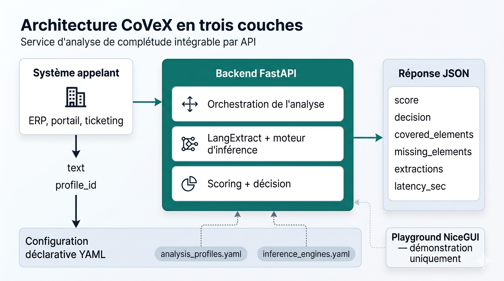
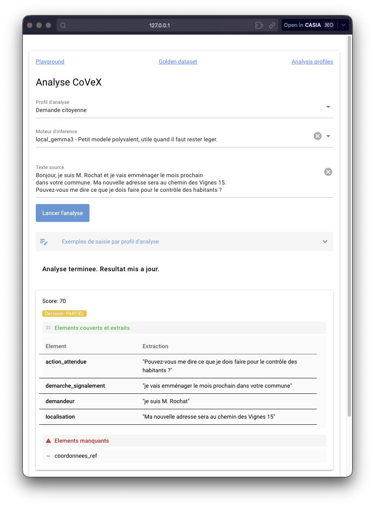

<!-- _class: lead -->

Travail de CAS en intelligence artificielle appliquée en entreprise

# CoVeX

## Vérification de la complétude des saisies textuelles métier par IA

Julien Burdy - Avril 2026

Déroulé de la présentation

  

    1
    <h3>Enjeu métier</h3>
    
qualité des saisies

  

  

    2
    <h3>Solution</h3>
    
profils et scoring

  

  

    3
    <h3>Conception</h3>
    
architecture, optimisations

  

  

    4
    <h3>Conclusion</h3>
    
illustration en direct

  

<!--
Temps cible : 1:00
Message : poser le sujet, la promesse et le fil directeur.
-->

---

Contexte

# Des textes saisis, pas toujours exploitables

  

    <h3>À la saisie</h3>
    <ul>
      <li>messages trop courts</li>
      <li>contexte absent</li>
      <li>informations critiques manquantes</li>
    </ul>
  

  

    <h3>En aval</h3>
    <ul>
      <li>relances et clarifications</li>
      <li>erreurs de traitement</li>
      <li>perte de valeur de la donnée</li>
    </ul>
  

<blockquote>
Le besoin n'est pas de mieux écrire, mais de mieux capturer l'information.
</blockquote>

<!--
Temps cible : 1:30
Exemples possibles : ticket IT "ça marche pas", demande d'achat sans budget ni urgence.
-->

---

Corpus métier

# Contextes variés

  

    <h3>Profils du golden dataset</h3>
    <ul class="compact-list">
      <li>support IT</li>
      <li>demandes d'achat</li>
      <li>comptes-rendus d'intervention</li>
      <li>demandes citoyennes</li>
      <li>devis construction</li>
      <li>rapports chantier</li>
      <li>suivi scolaire</li>
      <li>absences RH</li>
      <li>suivi projet</li>
      <li>évolutions produit</li>
      <li>validation qualité</li>
    </ul>
  

  

    <h3>Demandes incomplètes typiques</h3>
    <ul class="example-list">
      <li>« ça marche pas »</li>
      <li>« Il me faut une souris »</li>
      <li>« Je déménage bientôt dans votre commune »</li>
      <li>« Je serai absent bientôt pour un mariage »</li>
      <li>« Intervention terminée, mais il reste quelques points à reprendre »</li>
    </ul>
  

<!--
Temps cible : 1:15
Message : montrer que le problème n'est pas propre à l'IT ; il traverse plusieurs métiers.
-->

---

Problématique

# Quadruple tension

  

    <h3>Tension 1</h3>
    
La complétude dépend du <strong>contexte</strong>

  

  

    <h3>Tension 2</h3>
    
Préserver la <strong>fluidité de saisie</strong> actuelle

  

  

    <h3>Tension 3</h3>
    
Garder une <strong>maîtrise des données</strong>

  

  

    <h3>Tension 4</h3>
    
Éviter le <strong>blocage injustifié</strong>

  

<!--
Temps cible : 1:30
Formule utile : précision métier, fluidité, souveraineté, prudence.
-->

---

Réponse

# Le principe de CoVeX

  

    <h3>Entrée</h3>
    
<code>text</code> <code>profile_id</code>

  

  

    <h3>Analyse</h3>
    
- assemblage prompt / few-shot - appel moteur - extraction + scoring

  

  

    <h3>Sortie</h3>
    
<code>OK</code> / <code>PARTIEL</code> / <code>KO</code> éléments manquants / extractions

  

<blockquote>CoVeX est un <strong>service d'analyse intégrable</strong>, pas une application autonome.</blockquote>

<!--
Temps cible : 1:30
-->

---

<!--
Temps cible : 1:15
Message : montrer l'intégration par API, le backend FastAPI, la configuration YAML et la sortie JSON.
-->

---

Optimisation

# Algorithme de sélection de moteur

  

    <h3>Composition possible du <code>cost_score</code></h3>
    

      
<strong>Budget</strong>prix d'inférence

      
+

      
<strong>Latence</strong>vitesse attendue (a)sync?

      
+

      

        <strong>Souveraineté</strong>selon affinité et sensibilité
        

          
On-prem

          
Europe

          
US

          
Chine

        

      

    

    
La pondération est configurable : une donnée sensible peut privilégier la maîtrise géographique plutôt que le prix ou la vitesse.

  

  

    <h3>Algorithme</h3>
    

      
1

      
<strong>Profil</strong>partir du besoin métier

    

    

      
2

      
<strong>Tri</strong>ordonner par <code>cost_score</code>

    

    

      
3

      
<strong>Test</strong>rejouer le <code>golden dataset</code>

    

    

      
4

      
<strong>Choix</strong>retenir le premier moteur suffisant

    

  

  <strong>Objectif :</strong> choisir le plus petit moteur qui suffit pour le profil.

<!--
Temps cible : 2:00
-->

---

Conclusion / Enseignements

# Conclusion

  

    

    <h3>Conclusion</h3>
    <ul>
      <li>Évaluation prometteuse, mais à confirmer sur un corpus plus large.</li>
      <li>CoVeX doit guider l’utilisateur, sans blocage automatique.</li>
      <li>La complétude n’est pas universelle et dépend du métier, du contexte et de l’usage.</li>
    </ul> 
    

      

    <h3>Erreurs assumées</h3>
        <ul>
      <li>L’utilisation de BMad a été un apport et un apprentissage majeurs pour le cadrage du projet, mais sa rigueur a entraîné une <b>surspécification</b> qui a complexifié l'exercice. </li>
      <li>BMad utilisé depuis dans l'entreprise.</li>
    </ul>
    

<!--
Temps cible : 1:00
-->

---

<!-- _class: lead -->

  

Échange

# Questions

Merci pour votre attention.

<blockquote>CoVeX: Rendre visibles les manquements avant la dette informationnelle.</blockquote>
  

  

    
  

<!--
Slide de transition vers les 10 minutes de questions avec démonstration live.
-->
